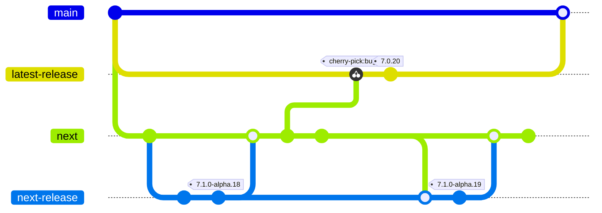
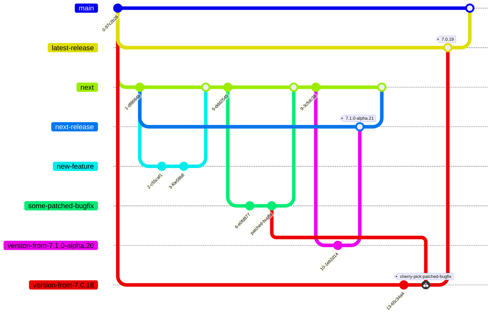
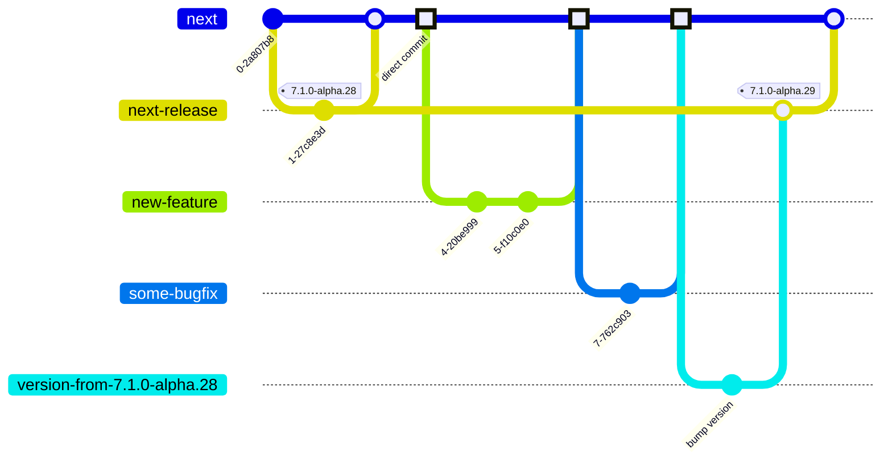
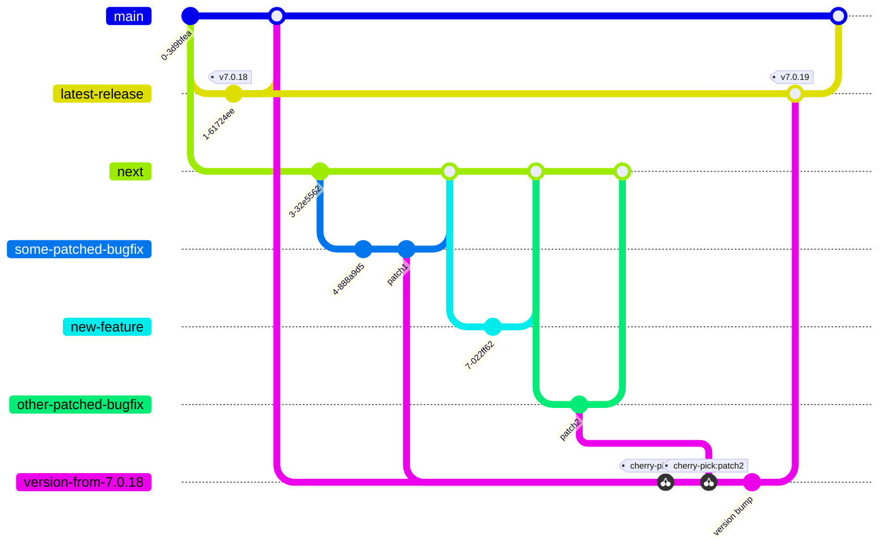
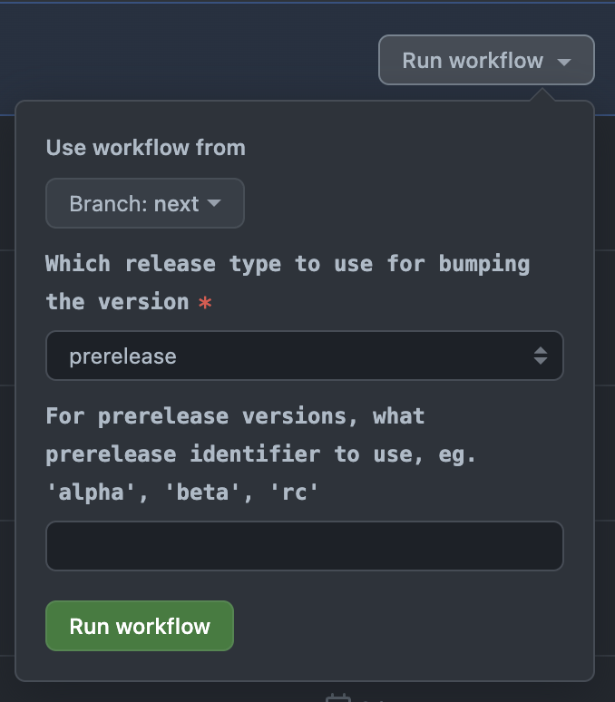

# Releasing <!-- omit in toc -->

> **Note**
> This document is only really relevant for any of the core team members that actually have permissions to release new versions of Storybook. Feel free to read it out of interest or to suggest changes, but as a regular contributor or maintainer you don't have to care about this.

## Table of Contents <!-- omit in toc -->

- [Introduction](#introduction)
  - [Branches](#branches)
- [The Release Pull Requests](#the-release-pull-requests)
  - [Prereleases](#prereleases)
  - [Patch releases](#patch-releases)
  - [Publishing](#publishing)
- [👉 How To Release](#-how-to-release)
  - [1. Find the Prepared Pull Request](#1-find-the-prepared-pull-request)
  - [2. Freeze the Pull Request](#2-freeze-the-pull-request)
  - [3. QA Each Merged Pull Request](#3-qa-each-merged-pull-request)
  - [4. Re-trigger the Workflow](#4-re-trigger-the-workflow)
  - [5. Make Manual Changes](#5-make-manual-changes)
  - [6. Merge](#6-merge)
  - [7. See the "Publish" Workflow Finish](#7-see-the-publish-workflow-finish)
- [Releasing Locally in Case of Emergency 🚨](#releasing-locally-in-case-of-emergency-)
- [Canary Releases](#canary-releases)
- [Versioning Scenarios](#versioning-scenarios)
  - [Prereleases - `7.1.0-alpha.12` -\> `7.1.0-alpha.13`](#prereleases---710-alpha12---710-alpha13)
  - [Prerelease promotions - `7.1.0-alpha.13` -\> `7.1.0-beta.0`](#prerelease-promotions---710-alpha13---710-beta0)
  - [Minor/major releases - `7.1.0-rc.2` -\> `7.1.0` or `8.0.0-rc.3` -\> `8.0.0`](#minormajor-releases---710-rc2---710-or-800-rc3---800)
  - [Patch releases to stable - subset of `7.1.0-alpha.13` -\> `7.0.14`](#patch-releases-to-stable---subset-of-710-alpha13---7014)
  - [Patch releases to earlier versions - subset of `7.1.0-alpha.13` -\> `6.5.14`](#patch-releases-to-earlier-versions---subset-of-710-alpha13---6514)
  - [Prerelease of upcoming patch release - `7.0.20` -\> `7.0.21-alpha.0`](#prerelease-of-upcoming-patch-release---7020---7021-alpha0)
- [FAQ](#faq)
  - [How do I make changes to the release scripts?](#how-do-i-make-changes-to-the-release-scripts)
  - [Why do I need to re-trigger workflows to update the changelog?](#why-do-i-need-to-re-trigger-workflows-to-update-the-changelog)
  - [Which combination of inputs creates the version bump I need?](#which-combination-of-inputs-creates-the-version-bump-i-need)
  - [Which changes are considered "releasable", and what does it mean?](#which-changes-are-considered-releasable-and-what-does-it-mean)
  - [Why are no release PRs being prepared?](#why-are-no-release-prs-being-prepared)
  - [Why do we need separate release branches?](#why-do-we-need-separate-release-branches)

## Introduction

This document describes how the release process for the Storybook monorepo is set up. There are mainly two different types of releases:

1. Prereleases and major/minor releases - releasing any content that is on the `next` branch
2. Patch releases - picking any content from `next` to `main`, that needs to be patched back to the current stable minor release

The release process is based on automatically created "Release Pull Requests", that when merged will trigger a new version to be released. A designated Releaser - can be a different team member from time to time - will go through the release process in the current Release PR.

The process is implemented with a set of NodeJS scripts at [`scripts/release`](../scripts/release/), invoked by three GitHub Actions workflows:

- [Prepare Prerelease PR](../.github/workflows/prepare-prerelease.yml)
- [Prepare Patch PR](../.github/workflows/prepare-patch-release.yml)
- [Publish](../.github/workflows/publish.yml)

> **Note**
> Throughout this document the distinction between **patch** release and **prereleases** are made. This is a simplification, since stable major and minor releases work the exact same way as **prereleases**, so that term covers those two cases as well. The distinction reflects the difference between releases updating the existing minor version on `main` with a new patch, or releasing a new minor/major/prerelease from `next`.

### Branches

To understand how all of this fits together in the repository, it's important to understand the branching strategy used.

All development is done against the default `next` branch, and any new features/bug fixes will almost always target that branch. The `next` branch contains the content ready to be released in the next prerelease. Any upcoming prerelease (eg. `v7.1.0-alpha.22`) will release the content of `next`.

The `main` branch contains the content for the current stable release, eg. `v7.0.20`.

Sometimes we're making changes that both need to be in the next major/minor release, and in the current patch release. That might be bug fixes or small quality-of-life improvements. Making all changes target `next` ensures that the bugfix will land in the upcoming prerelease. To also get the change patched back to the current minor version (eg. from `7.1.0-alpha.20` to `7.0.18`), the PR containing the fix will get the **"patch"** label. That label tells the release workflow that it should pick that PR for the next patch release.
This structure ensures that the changes are safely tried out in a prerelease, before being released to stable.

There are many nuances to the process defined above, which are described in greater detail in [the "Versioning Scenarios" section](#versioning-scenarios) below.

The actual (pre)releases aren't actually released from `next` nor `main`, but from `next-release` and `latest-release` respectively. That means that `next-release` and `latest-release` follow `next` and `main` closely, but they are not always in complete sync - which is on purpose. The reason for this indirection is described in [the "Why do we need separate release branches?" section](#why-do-we-need-separate-release-branches) below.

At a high level, the branches in the monorepo can be described in this diagram (greatly simplified):

## The Release Pull Requests

The release pull requests are automatically created by two different GitHub Actions workflows, one for each type of release. These pull requests are the "interface" for the Releaser to create a new release. The behavior between the two is very similar, with some minor differences described in the subsections. The high-level flow is:

1. When a PR is merged to `next` (or a commit is pushed), both release pull requests are (re)generated
2. They create a new branch - `version-(patch|prerelease)-from-<CURRENT-VERSION>`
3. Bump all versions according to the version strategy (more on that below)
4. Update `CHANGELOG(.prerelease).md` with all changes detected
5. Commit everything
6. **Force push**
7. Open/edit pull request towards `next-release` or `latest-release`

A few important things to note in this flow:

- The PRs are regenerated on any changes to `next`, and a re-generation can be manually triggered as well (more on that in [How To Release](#how-to-release))
- The changes are force pushed to the branch. Combining that with the bullet above, it means that if you commit any manual changes on the release branch before merging it, they risk being overwritten if a new change is merged to `next` by someone else, triggering the workflow. To mitigate this, [apply the **"freeze"** label to the pull request](#how-to-release).
- The version bumps and changelogs are committed during the preparation, but the packages are _not actually published_ until [later](#publishing). This is a non-standard paradigm, where usually bumping versions and publishing packages happens at the same time.
- The release pull requests don't target their working branches (`next` and `main`), but rather the release-focused `next-release` and `latest-release`.

### Prereleases

> **Note**
> Workflow: [`prepare-prerelease.yml`](../.github/workflows/prepare-prerelease.yml)

Prereleases are prepared with all content from `next`. The changelog is generated by using the git history, and looking up all the commits and PRs between the currently released prerelease (on `next-release`) and `HEAD` of `next`.

The default versioning strategy is to bump the current prerelease number, as described in [Prereleases - `7.1.0-alpha.12` -> `7.1.0-alpha.13`](#prereleases---710-alpha12---710-alpha13). If there is no prerelease number (ie. we just released a new stable minor/major) it will add one to a patch bump, so it would go from `7.2.0` to `7.2.1-0` per default.

Prerelease PRs are only prepared if there are actual changes to release, otherwise, the workflow will be canceled. `next` can have new content which is only labeled with "build" or "documentation", which isn't user-facing so it's [not considered "releasable"](#which-changes-are-considered-releasable-and-what-does-it-mean). In that case, it doesn't make sense to create a release, as it won't bump versions nor write changelogs so it would just merge the same content back to `next`. This is explained more deeply in [Why are no release PRs being prepared?](#why-are-no-release-prs-being-prepared).

The preparation workflow will create a new branch from `next` called `version-from-<CURRENT-PRERELEASE-VERSION>`, and open a pull request that targets `next-release`. When that is merged by the Releaser, the [publish workflow](#publishing) will eventually merge `next-release` into `next`.

Here's an example of a workflow where a feature and a bugfix have been created and then released to a new `7.1.0-alpha.29` version. All the highlighted commits (square dots) are the ones that will be considered when generating the changelog.

### Patch releases

> **Note**
> Workflow: [`prepare-patch-release.yml`](../.github/workflows/prepare-patch-release.yml)

Patch releases are prepared by [cherry-picking](https://www.atlassian.com/git/tutorials/cherry-pick) any merged, unreleased pull requests to `next` that have the "**patch**" label applied. The merge commit of said pull requests are cherry-picked.

Sometimes it's desired to pick pull requests back to `main` even if they are [not considered "releasable"](#which-changes-are-considered-releasable-and-what-does-it-mean), so opposite of the prerelease preparation, patch releases will _not cancel_ if the content is not releasable.
On the surface, it might not make sense to create a new patch release if the changes are only for documentation and/or internal build systems. But getting the changes back to `main` is the only way to get the documentation deployed to the production docs site. You also might want to cherry-pick changes to internal CI to fix issues or similar. Both of these cases are valid scenarios where you want to cherry-pick the changes without being blocked on "releasable" content to be ready. In these cases where all cherry picks are non-releasable, the preparation workflow creates a "merging" pull request instead of a "releasing" pull request. In this state, it doesn't bump versions and it doesn't update changelogs, it just cherry-picks the changes and allows you to merge them into `latest-release` -> `main`.

The preparation workflow sequentially cherry-picks each patch pull request to its branch. Sometimes this cherry-picking fails because of conflicts or for other reasons, in which case it ignores it and moves on to the next. All the failing cherry-picks are finally listed in the release pull request's description, for the Releaser to manually cherry-pick during the release process.
This problem occurs more often the more `main` and `next` diverges, ie. the longer it has been since a stable major/minor release.

Similar to the prerelease flow, the preparation workflow for patches will create a new branch from `main` called `version-from-<CURRENT-STABLE-VERSION>`, and open a pull request that targets `latest-release`. When that is merged by the Releaser, the [publish workflow](#publishing) will eventually merge `latest-release` into `main`.

Here's an example of a workflow where a feature and two bug fixes have been merged to `next`. Only the bug fixes have the "**patch**" label, so only those two go into the new `7.0.19` release. Note that while the diagram shows the commits _on_ the bugfix branches being cherry-picked, it's actually their merge commits to `next` that gets picked - this is a limitation of mermaid graphs.

### Publishing

> **Note**
> Workflow: [`publish.yml`](../.github/workflows/publish.yml)

When either a prerelease or a patch release branch is merged to `main|next-release`, the publishing workflow is triggered. This workflow does the following on a high level:

1. Install dependencies and build all packages
2. Publish packages to npm
3. (If this is a patch release, add the "**picked**" label to all picked pull requests)
4. Create a new GitHub Release - also creating a version tag at the release branch (`latest-release` or `next-release`)
5. Merge the release branch into the core branch (`main` or `next`)
6. (If this is a patch release, copy the `CHANGELOG.md` changes from `main` to `next`)
7. (If this is [a promotion from a prerelease to a stable release](#minormajor-releases---710-rc2---710-or-800-rc3---800), force push `next` onto `main`)

The publish workflow runs in the "release" GitHub environment, which has the npm token needed to publish packages to the `@storybook` npm organization. For security reasons this environment can only be entered from the four "core" branches: `main`, `next`, `latest-release` and `next-release`.

## 👉 How To Release

This section describes what to do as a Releaser when it's time to release. Most of what's described here is also described in the release pull requests, in an attempt at making them a guide/to-do list for inexperienced Releasers.

The high-level workflow for a Releaser is:

1. Find the prepared pull request
2. Freeze the pull request
3. Make changes to merged pull requests (revert, rename, relabel)
4. Re-trigger the workflow to get changes from step 3 in
5. Make any manual changes necessary
6. Merge
7. See that the "publish" workflow finished successfully

### 1. Find the Prepared Pull Request

Find the release pull request that has been prepared for the type of release you're about to release:

- "Release: Prerelease `<NEXT-VERSION>`" for prereleases
- "Release: Patch `<NEXT-VERSION>`" for patch releases
- "Release: Merge patches to `main` (without version bump)" for patches without releases

Here's an example of such a pull request: https://github.com/storybookjs/storybook/pull/23148

### 2. Freeze the Pull Request

Freeze the pull request by adding the "**freeze**" label to it.

This instructs the preparation workflows to cancel and not do anything when new changes to `next` are merged. That way, you can make any changes you want to without needing to worry about other's work overriding your changes.

Crucially this "**freeze**" label doesn't cancel the workflows when they are triggered manually, allowing you - the Releaser - to run the workflow even when it's frozen.

### 3. QA Each Merged Pull Request

You need to ensure that the release contains the correct stuff. The main things to check for are:

1. Is the change appropriate for the version bump?

This usually means checking if it's a breaking change that is not allowed in a minor prerelease, or if it's a new feature in a patch release.
If it's not appropriate, revert the pull request and notify the author.

2. Is the pull request title correct?

The title of pull requests are added to the user-facing changelogs, so they must be correct and understandable. They should follow the pattern "[Area]: [Summary]", where [Area] is which part of the repo that has been changed, and the summary is what has changed.

It's common to confuse [Area] with labels, but they are not the same. Eg. the "**build**" label describes that the changes are only internal, but a "build" [Area] is _not_ correct. The area could be "Core" or "CI", but very rarely is the area being changed actually the "build" area.
It can be hard to pick an area when a pull request changes multiple places - this is often common when upgrading dependencies - so use your best judgement. There's no hard rule, but a good guideline is that the more precise it is, the more useful it is to read later.

3. Is the pull request labeled correctly?

Some labels have special meaning when it comes to releases. It's important that each pull request has labels that correctly identify the change, because labels can determine if a pull request is included in the changelog or not. A deeper explanation of this concept is given in the [Which changes are considered "releasable", and what does it mean?](#which-changes-are-considered-releasable-and-what-does-it-mean) section.

4. Patches: has it already been released in a prerelease?

If this is a patch release, it's best that you make sure that all pull requests have already been released in a prerelease. If some haven't, create a new prerelease first.

There's no technical reason for this, it's purely a good practice to ensure that a change doesn't break a prerelease before releasing it to stable.

### 4. Re-trigger the Workflow

Any changes you made to pull requests' titles, labels or even reverts won't be reflected in the release pull request, because:

A. It's hopefully frozen at this point
B. Even if it isn't, the workflow only triggers on pushes to `next`, it doesn't trigger when pull request meta data is changed

Therefore if you've made any changes in step 3, you need to re-trigger the workflow manually to regenerate the changelog and the version bump. If you haven't made any changes previously this step can be skipped.

It's important to know that triggering the workflow will force push changes to the branch, so you need to do this before comitting any changes manually (which is the next step), as they will otherwise get overwritten.

> ** Warning **
> When re-triggering the workflow, any new content merged to `next` will also become part of the release pull request. You can't just assume that you'll see the same content again but with fixes, as there could have been merged new content in since you froze the pull request.

When triggering the workflows, always choose the `next` branch as the base unless you know exactly what you're doing.

The workflows can be triggered here:

- [Prepare prerelease PR](https://github.com/storybookjs/storybook/actions/workflows/prepare-prerelease.yml)
- [Prepare patch PR](https://github.com/storybookjs/storybook/actions/workflows/prepare-patch-release.yml)

Crucially for prereleases, this is also where you change the versioning strategy if you need something else than the default as described in [Preparing - Prereleases](#prereleases). When triggering the prerelease workflow manually, you can optionally add inputs:

See [Versioning Scenarios](#versioning-scenarios) for a description of each version bump scenario, how to activate it and what it does, and [Which combination of inputs creates the version bump I need?](#which-combination-of-inputs-creates-the-version-bump-i-need) for a detailed description of the workflow inputs.

### 5. Make Manual Changes

It's possible and perfectly valid to push manual changes directly on the release branch when needed. Maybe you need to alter the changelog in a way that can't be done purely automatical, or there's another critical change that is needed for the release to work. Any change you make will eventually be merged to `next|main` when the release has been published.

This can be used as a quick and dirty way to fix a changelog without needing to change pull requests and waiting for workflows to finish. However it is recommended that you try to use the automated process as much as possible for this, to ensure that the information in GitHub is the single source of truth, and that pull requests and changelogs are in sync.

### 6. Merge

When you froze the pull request you also triggered a CI run on the branch. If it's green it's time to merge the pull request.

If CI is failing for some reason consult with the rest of the core team. These release pull requests are almost exact copies of `next|main` so CI should only fail if they fail too.

### 7. See the "Publish" Workflow Finish

Merging the pull request will trigger [the publish workflow](https://github.com/storybookjs/storybook/actions/workflows/publish.yml), which does the final publishing. As a Releaser you're responsible for this to finish succesfully, so you should watch it till the end.
If it fails it will notify in Discord, so you can monitor that instead if you want to.

Done! 🚀

## Releasing Locally in Case of Emergency 🚨

Things fail. Code breaks. Bugs exists.

Sometimes we need an emergency escape hatch to release new fixes, even if the automation is broken.

In those situations it's perfectly valid to run the whole release process locally instead of relying on the pull requests and workflows as usual. When doing this you don't need to create the pull requests either, or split preparation and publishing, you're free to do it all at the same time, but you need to make sure that you follow the correct branching strategy still.

You need a token to the npm registry to be able to publish (set as `YARN_NPM_AUTH_TOKEN` below). Currently @shilman and @ndelangen holds the keys to that castle.

You can always inspect the workflows to see exactly what they are running and copy that, but below is a general sequence of steps you can take to mimic the automated workflow. Feel free to diverge from this however you need to succeed.

1. Create a new branch from either `next` (prereleases) or `main` (patches)
2. Get all tags: `git fetch --tags origin`
3. `cd scripts`
4. (if patch release) Cherry pick:
   1. `yarn release:pick-patches`
   2. manually cherry pick any patches necessary based on the previous output
5. Bump versions: `yarn release:version --verbose --release-type <RELEASE_TYPE> --pre-id <PRE_ID>`
6. To see a list of changes (for your own todo list), run `yarn release:generate-pr-description --current-version <CURRENT_VERSION> --next-version <NEXT_VERSION_FROM_PREVIOUS_STEP> --verbose`
7. Write changelogs: `yarn release:write-changelog <NEXT_VERSION_FROM_PREVIOUS_STEP> --verbose`
8. `git add .`
9. Commit changes: `git commit -m "Bump version from <CURRENT_VERSION> to <NEXT_VERSION_FROM_PREVIOUS_STEP> MANUALLY"`
10. Merge changes to the release branch:
    1. `git checkout <"latest-release" | "next-release">`
    2. `git merge <PREVIOUS_BRANCH>`
    3. `git push origin`
11. (if automatic publishing is still working it should kick in now and the rest of the steps can be skipped)
12. `cd ..`
13. Install dependencies: `yarn task --task=install --start-from=install`
14. Publish to the registry: `YARN_NPM_AUTH_TOKEN=<NPM_TOKEN> yarn release:publish --tag <"next" OR "latest"> --verbose`
15. (if patch release) `yarn release:label-patches`
16. [Manually create a GitHub Release](https://github.com/storybookjs/storybook/releases/new) with a tag that is the new version and the target being `latest-release` or `next-release`.
17. Merge to core branch:
    1. `git checkout <"next"|"main">`
    2. `git merge <"next-release"|"latest-release">`
    3. `git push origin`
18. (if patch release) sync `CHANGELOG.md` to `next` with:
    1. `git checkout next`
    2. `git pull`
    3. `git checkout origin/main ./CHANGELOG.md`
    4. `git add ./CHANGELOG.md`
    5. `git commit -m "Update CHANGELOG.md for v<NEXT_VERSION>"`
    6. `git push origin`

## Canary Releases

Not implemented yet. Still work in progress, stay tuned.

## Versioning Scenarios

There are six types of releases that are done somewhat differently, but following the overall same principles as described previously.

### Prereleases - `7.1.0-alpha.12` -> `7.1.0-alpha.13`

**Cadence: Multiple times a week**

This is the default strategy for prereleases, there's nothing special needed to trigger this scenario.

### Prerelease promotions - `7.1.0-alpha.13` -> `7.1.0-beta.0`

**Cadence: Once every 1-2 months**

To promote a prerelease to a new prerelease ID, during the [Re-trigger the Workflow](#4-re-trigger-the-workflow) step, choose:

- Release type: Prerelease
- Prerelease ID: The ID to promote to. Eg. for alpha -> beta, write "beta"

### Minor/major releases - `7.1.0-rc.2` -> `7.1.0` or `8.0.0-rc.3` -> `8.0.0`

**Cadence: Once every quarter**

To promote a prerelease to a new prerelease ID, during the [Re-trigger the Workflow](#4-re-trigger-the-workflow) step, choose:

- Release type: Patch
- Prerelease ID: Leave empty

The "Patch" release type ensures the current prerelease version gets promoted to a stable version without any major/minor/patch bumps.

This scenario is special in that it turns the `next` branch into a stable branch (until the next prerelease). Therefore this will also force push `next` to `main`, to ensure that `main` contains the latest stable release. Consequently, the history for `main` is lost.

### Patch releases to stable - subset of `7.1.0-alpha.13` -> `7.0.14`

**Cadence: Every second week**

This is the default patch release scenario, that cherry picks patches to `main`.

### Patch releases to earlier versions - subset of `7.1.0-alpha.13` -> `6.5.14`

**Cadence: 2-3 times a year**

This happens so rarely on a case by case basis, so this is a completely manual process that isn't accounted for in the automation. The Releaser will find the git tag that matches the patch to bump, eg. `v6.5.14`, check it out, make the necessary changes and follow [the manual release process](#releasing-locally-in-case-of-emergency-🚨).

### Prerelease of upcoming patch release - `7.0.20` -> `7.0.21-alpha.0`

**Cadence: Very rare**

In some cases a patch change is so big and complex that it makes sense to first release it as a prerelease of the current patch stable version to see if it works, before releasing it to stable shortly thereafter.

There is no process defined for this.

## FAQ

### How do I make changes to the release scripts?

(patch script changes back to main, either manually or via the patching flow)

### Why do I need to re-trigger workflows to update the changelog?

### Which combination of inputs creates the version bump I need?

Link to tests, and to version strategies above.

### Which changes are considered "releasable", and what does it mean?

link to the enums

### Why are no release PRs being prepared?

### Why do we need separate release branches?
