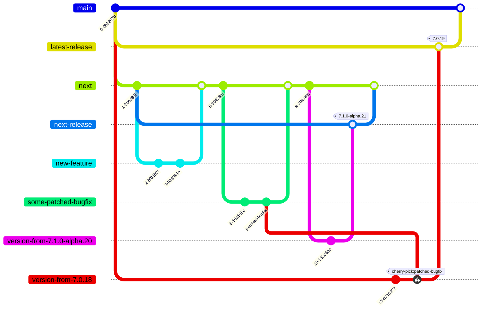

# Releasing <!-- omit in toc -->

> **Note**
> This document is only really relevant for any of the core team members that actually have permissions to release new versions of Storybook. Feel free to read it out of interest or to suggest changes, but as a regular contributor or maintainer you don't have to care about this.

## Table of Contents <!-- omit in toc -->

- [Introduction](#introduction)
  - [Branches](#branches)
- [The Release Pull Requests](#the-release-pull-requests)
  - [Prereleases](#prereleases)
  - [Patch releases](#patch-releases)
  - [Publishing](#publishing)
- [How To Release](#how-to-release)
  - [Prereleases](#prereleases-1)
  - [Patch releases](#patch-releases-1)
  - [Manual Changes](#manual-changes)
- [Releasing Locally in Case of Emergency 🚨](#releasing-locally-in-case-of-emergency-)
- [Versioning Scenarios](#versioning-scenarios)
  - [Prereleases - `7.1.0-alpha.12` -\> `7.1.0-alpha.13`](#prereleases---710-alpha12---710-alpha13)
  - [Prerelease promotions - `7.1.0-alpha.13` -\> `7.1.0-beta.0`](#prerelease-promotions---710-alpha13---710-beta0)
  - [Minor/major releases - `7.1.0-rc.2` -\> `7.1.0` or `8.0.0-rc.3` -\> `8.0.0`](#minormajor-releases---710-rc2---710-or-800-rc3---800)
  - [Patch releases to stable - subset of `7.1.0-alpha.13` -\> `7.0.14`](#patch-releases-to-stable---subset-of-710-alpha13---7014)
  - [Patch releases to earlier versions - subset of `7.1.0-alpha.13` -\> `6.5.14`](#patch-releases-to-earlier-versions---subset-of-710-alpha13---6514)
  - [Prerelease of upcoming patch release - `7.0.20` -\> `7.0.21-alpha.0`](#prerelease-of-upcoming-patch-release---7020---7021-alpha0)
- [FAQ](#faq)
  - [How do I make changes to the release scripts?](#how-do-i-make-changes-to-the-release-scripts)
  - [Why do I need to re-trigger workflows to update the changelog?](#why-do-i-need-to-re-trigger-workflows-to-update-the-changelog)
  - [Why are no release PRs being prepared?](#why-are-no-release-prs-being-prepared)
  - [Why do we need separate release branches?](#why-do-we-need-separate-release-branches)

## Introduction

This document describes how the release process for the Storybook monorepo is set up. There are mainly two different types of releases:

1. Prereleases and major/minor releases - releasing any content that is on the `next` branch
2. Patch releases - picking any content from `next` to `main`, that needs to be patched back to the current stable minor release

The release process is based on automatically created "Release Pull Requests", that when merged will trigger a new version to be released. A designated Releaser - can be a different team member from time to time - will go through the release process in the current Release PR.

The process is implemented with a set of NodeJS scripts at [`scripts/release`](../scripts/release/), invoked by three GitHub Actions workflows:

- [Prepare Prerelease PR](../.github/workflows/prepare-prerelease.yml)
- [Prepare Patch PR](../.github/workflows/prepare-patch-release.yml)
- [Publish](../.github/workflows/publish.yml)

### Branches

To understand how all of this fits together in the repository, it's important to understand the branching strategy used.

All development is done against the default `next` branch, and any new features/bugfixes will almost always target that branch. The `next` branch contains the content ready to be released in the next prerelease. Any upcoming prerelease (eg. `v7.1.0-alpha.22`) will release the content of `next`.

The `main` branch contains the content for the current stable release, eg. `v7.0.20`.

Sometimes we're making changes that both needs to be in the next major/minor release, and in the current patch release. That might be bugfixes or small quality-of-life improvements. Making all changes target `next` ensures that the bugfix will land in the upcoming prerelease. To also get the change patched back to the current minor version (eg. from `7.1.0-alpha.20` to `7.0.18`), the PR containing the fix will get the **"patch"** label. That label tells the release workflow that it should pick that PR for the next patch release.
This structure ensures that the changes are safely tried out in a prerelease, before being released to stable.

There are many nuances to the process defined above, which are described in greater detail in [the "Versioning Scenarios" section](#versioning-scenarios) below.

The actual (pre)releases aren't actually released from `next` nor `main`, but from `next-release` and `latest-release` respectively. That means that `next-release` and `latest-release` follow `next` and `main` closely, but they are not always in complete sync - which is on purpose. The reason for this indirection is described in [the "Why do we need separate release branches?" section](#why-do-we-need-separate-release-branches) below.

At a high level, the branches in the monorepo can be described in this diagram (greatly simplified):

## The Release Pull Requests

The release pull requests are automatically created by two different GitHub Actions workflows, one for each type of release. These pull requests are the "interface" for the Releaser to create a new release. The behavior between the two is very similar, with some minor differences described in the subsections. The high-level flow is:

1. When a PR is merged to `next` (or a commit is pushed), both release pull requests are (re)generated
2. They create a new branch - `version-(patch|prerelease)-from-<CURRENT-VERSION>`
3. Bump all versions according to the version strategy (more on that below)
4. Update `CHANGELOG(.prerelease).md` with all changes detected
5. Commit everything
6. **Force push**
7. Open/edit pull request towards `next-release` or `latest-release`

A few important things to note in this flow:

- The PRs are regenerated on any changes to `next`, and a re-generation can be manually triggered as well (more on that in [How To Release](#how-to-release))
- The changes are force pushed to the branch. Combining that with the bullet above, it means that if you commit any manual changes on the release branch before merging it, they risk being overwritten if a new change is merged to `next`, triggering the workflow. To mitigate this, [apply the **"freeze"** label to the pull request](#how-to-release).
- The version bumps and changelogs are committed during the preparation, but the packages are _not actually published_ until later. This is a non-standard paradigm, where usually bumping versions and publishing packages happens at the same time.
- The release pull requests don't target their working branches (`next` and `main`), but rather the release-focused `next-release` and `latest-release`.

### Prereleases

### Patch releases

### Publishing

## How To Release

### Prereleases

> **Note**
> This actually also covers how to promote a prerelease to stable. This is basically any other releases than backported patch releases, which are described in the next section

### Patch releases

All changes should already have been prereleased

### Manual Changes

## Releasing Locally in Case of Emergency 🚨

## Versioning Scenarios

There are five types of releases that will be handled somewhat differently, but following the overall same principles as described above.

### Prereleases - `7.1.0-alpha.12` -> `7.1.0-alpha.13`

These happen multiple times a week

1. A PR will automatically be opened from a fresh branch `version-from-7.1.0-alpha.16` to `next-release` on every push to `next`. If the PR is already open, it will be kept up-to-date with description changes and force pushing commits. This process can also be manually triggered if needed.
2. The PR will consist of:
   1. Version bumps in all `package.json`s and other files like `versions.ts`
   2. Changes to `CHANGELOG.md` generated as specced below
   3. Changes listed in the PR description, along with a checklist to go through manually
3. When we're ready to release, a Releaser will go through the check list:
   1. Freeze the PR by applying the "freeze" label on it, stopping any actions from modifying it further
   2. QA each PR that is part of the release:
      1. Is the changelog high quality - it's based on PR titles, which are usually bad.
      2. Change any PR titles necessary
      3. Check that each PR content is high quality, has it been tested, are we sure it's not a breaking change, etc.
      4. revert any bad PRs
   3. If necessary, manually trigger the workflow again, to reflect changes to PR titles and reverts (manual triggers should ignore the "freeze" label)
   4. Merge the PR to `next-release`
4. When the PR is merged, an action will:
   1. publish all packages
   2. create a GitHub Release
   3. tag the commit
   4. merge `next-release` back to `next`. If this causes a merge conflict, this will have to be done manually
5. ... the cycle starts over

### Prerelease promotions - `7.1.0-alpha.13` -> `7.1.0-beta.0`

These happen once every 1-2 months

Same process as above, except before merging, the Releaser manually triggers the Action with a "tag: beta" input, that will change versions from the proposed `7.1.0-alpha.14` to `7.1.0-beta.0`.

### Minor/major releases - `7.1.0-rc.2` -> `7.1.0` or `8.0.0-rc.3` -> `8.0.0`

These happen once every quarter

Same process as above, except before merging, the Releaser manually triggers the Action with a "tag: stable" input, that will change versions from the proposed `7.1.0-rc.3` to `7.1.0`. When the PR is merged, the action will do the usual publishing work, and **force merge `next` into `main`**. The following GitHub Action that triggers on a push to `next` will generate a release PR with `7.2.0-alpha.0`, to start the cycle over.

### Patch releases to stable - subset of `7.1.0-alpha.13` -> `7.0.14`

These happen roughly every second week

This process is a bit different from the above because it needs to merge to the `main` branch and not `next`, but the principle is the same.

1. Any PR to `next` that needs to be patched back to stable, needs to have a "patch" label
2. On pushes to `next`, an action check for any such PRs with the "patch" label
3. It will create a release branch (`version-from-7.0.11`) and PR similar to the one for prereleases, except that it targets `main`.
4. Each "patch" PR that it finds it will attempt to cherry-pick to the `version-from-7.0.11` branch
5. Sometimes it might cause merge conflicts, in which case the PR will be skipped
6. When all is done, the description for the release PR will contain a list of PRs that couldn't be cherry picked, for the Releaser to manually do that and solve any merge conflicts.
7. An important additional step for the Releaser is to check that all PRs are actually patches/fixes, and not new features, and that everything actually works, given that some cherry picked PRs could rely on functionality not yet found in stable.

When the PR has been merged to `main-release` by the Releaser, after the usual publishing steps, the action will also label all patched PRs with "picked" so they are ignored for the next patch release.

### Patch releases to earlier versions - subset of `7.1.0-alpha.13` -> `6.5.14`

These happen 2-3 times a year

Given that this happens so rarely on a case by case basis, I'm okay with this being a completely manual process. The only thing we then need to keep in mind, is that all these versioning and publishing scripts needs to be executable locally, outside of a GitHub Action.

### Prerelease of upcoming patch release - `7.0.20` -> `7.0.21-alpha.0`

## FAQ

### How do I make changes to the release scripts?

(patch script changes back to main, either manually or via the patching flow)

### Why do I need to re-trigger workflows to update the changelog?

### Why are no release PRs being prepared?

### Why do we need separate release branches?
