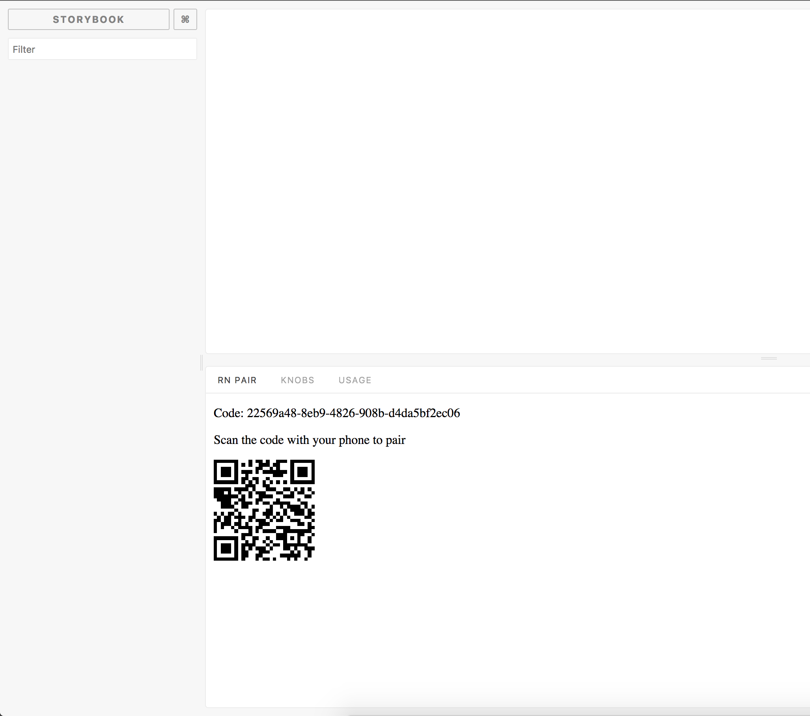

# Storybook Addon Actions

[](https://greenkeeper.io/)
[](https://travis-ci.org/storybooks/storybook)
[](https://www.codefactor.io/repository/github/storybooks/storybook)
[](https://snyk.io/test/github/storybooks/storybook/8f36abfd6697e58cd76df3526b52e4b9dc894847)
[](https://bettercodehub.com/results/storybooks/storybook) [](https://codecov.io/gh/storybooks/storybook)
[](https://storybooks-slackin.herokuapp.com/)

Storybook Addon RN Pair can be used to connect hosted storybook server with app [Storybook](https://storybook.js.org).
It allows you to simply point your phone camera to browser screen and phone will be automatically connected.


## Getting Started

Install:

```sh
npm i -D @storybook/addon-rn-pair
```

Then, add following content to `.storybook/addons.js`

    import '@storybook/addon-rn-pair/register';

Then you need to use qr code reader in your storybook app.

TODO write more about reader.
