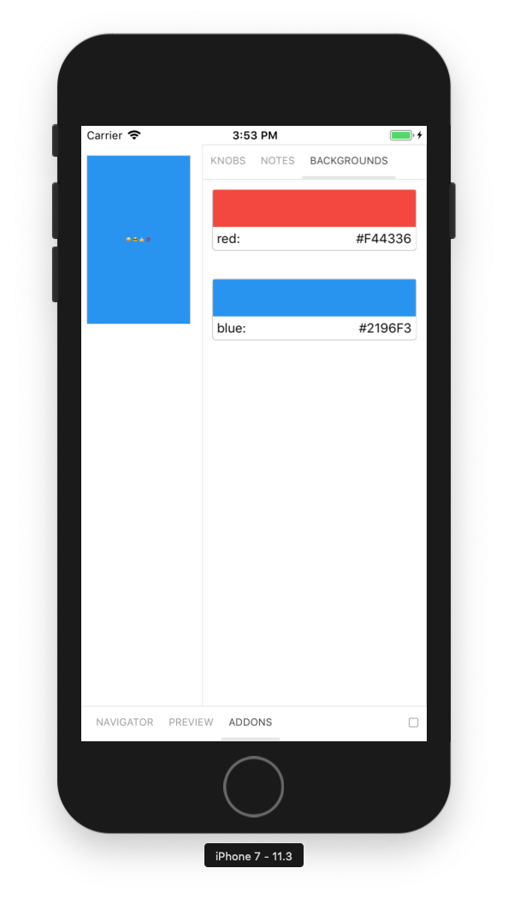

# Storybook for React Native On Device

With Storybook for React Native On Device you can design and develop individual React Native components without running your app.



For more information visit: [storybook.js.org](https://storybook.js.org)

## Getting Started

Since this is an early release for standalone on device implementation, please refer to docs/manual-setup.md

## Start App

To see your Storybook stories on the device, you should start your mobile app for the `<platform>` of your choice (typically `ios` or `android`).

For CRNA apps:

    npm run <platform>

For RN apps:

    react-native run-<platform>

Once your app is started, changing the selected story in web browser will update the story displayed within your mobile app.

If you are using Android and you get the following error after running the app: `'websocket: connection error', 'Failed to connect to localhost/127.0.0.1:7007'`, you have to forward the port 7007 on your device/emulator to port 7007 on your local machine with the following command:
`adb reverse tcp:7007 tcp:7007`

## getStorybookUI Options

You can pass these parameters to getStorybookUI call in your storybook entry point:

```
{
    onDeviceUI: Boolean (true)
        -- display navigator and addons on the device
    disableWebsockets: Boolean (false)
        -- allows to display stories without running storybook server. Should be used with onDeviceUI
    secured: Boolean (false)
        -- use wss/https instead of ws/http
    host: String (NativeModules.SourceCode.scriptURL)
        -- host to use
    port: Number (7007)
        -- port to use
    query: String ("")
        -- additional query string to pass to websockets
    isUIHidden: Boolean (false)
        -- should the ui be closed initialy.
    tabOpen: Number (0)
        -- which tab should be open. -1 Navigator, 0 Preview, 1 Addons
}
```

## Learn More

Check the `docs` directory in this repo for more advanced setup guides and other info.
