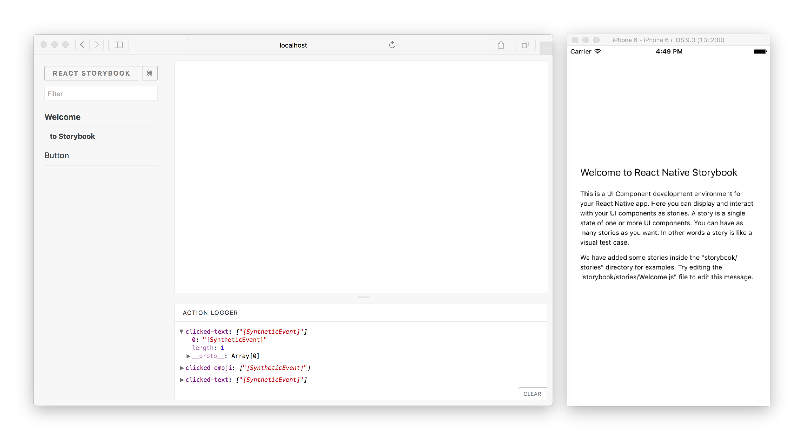

# Storybook for React Native

With Storybook for React Native you can design and develop individual React Native components without running your app.



For more information visit: [storybook.js.org](https://storybook.js.org)

## Getting Started

The `getstorybook` tool can be used to add Storybook to your React Native app. Install the `getstorybook` tool if necessary and run it from your project directory with these commands:

```shell
npm -g i @storybook/cli
getstorybook
```

The next thing you need to do is make Storybook UI visible in your app.

### CRNA, React Native vanilla

The easiest way to use Storybook is to simply replace your App with the Storybook UI, which is possible by replacing `App.js` with a single line of code:

```js
export default from './storybook';
```

This will get you up and running quickly, but then you lose your app!
There are multiple options here. for example, you can export conditionally:

```js
import StorybookUI from './storybook';

import App from './app';

module.exports = __DEV__ ? StorybookUI : App;
```

### RNN, other use cases

`StorybookUI` is simply a RN `View` component that can be embedded anywhere in your RN application, e.g. on a tab or within an admin screen.


## Start Storybook server (optional)
If you want to control storybook from browser/VS Code/websockets you need to start the server.
After initial setup start the storybook server with the storybook npm script.

```shell
npm run storybook
```

Now, you can open <http://localhost:7007> to view your storybook menus in the browser.

## Start App

To see your Storybook stories on the device, you should start your mobile app for the `<platform>` of your choice (typically `ios` or `android`). (Note that due to an implementation detail, your stories will only show up in the left pane of your browser window after your device has connected to this storybook server.)

For CRNA apps:

    npm run <platform>

For RN apps:

    react-native run-<platform>

Once your app is started, changing the selected story in web browser will update the story displayed within your mobile app.

If you are using Android and you get the following error after running the app: `'websocket: connection error', 'Failed to connect to localhost/127.0.0.1:7007'`, you have to forward the port 7007 on your device/emulator to port 7007 on your local machine with the following command:
`adb reverse tcp:7007 tcp:7007`

## Using Haul-cli

[Haul](https://github.com/callstack-io/haul) is an alternative to the react-native packager and has several advantages in that it allows you to define your own loaders, and handles symlinks better.

If you want to use haul instead of the react-native packager, modify the storybook npm script to:

```sh
storybook start -p 7007 --haul webpack.haul.storybook.js --platform android | ios | all
```

Where webpack.haul.storybook.js should look something like this:

```js
module.exports = ({ platform }) => ({
  entry: `./storybook/index.${platform}.js`,
  // any other haul config here.
});
```

## Seamless Typescript Integration

*Note: These instructions are for react-native >= 0.45, @storybook/react-native >= 4.0.0-alpha.2 or higher and the (default) [metro](https://github.com/facebook/metro) bundler*

For seamless type integration (no intermediate build step) we use the custom rn cli config feature and the [react-native-typescript-transformer](https://github.com/ds300/react-native-typescript-transformer) project 

First follow the instructions [here](https://github.com/ds300/react-native-typescript-transformer#step-1-install).

Now update your storybook `package.json` script to the following

    "scripts": {
       "storybook": "storybook --metro-config $PWD/rn-cli.config.js"
    }

The metro bundler requires an absolute path to the config. The above setup assumes the `rn-cli.config.js` is in the root of your project or next to your `package.json`

## Start Command Parameters

The following parameters can be passed to the start command:

```
-h, --host <host> 
    host to listen on
-p, --port <port>
    port to listen on
-s, --secured
    whether server is running on https
-c, --config-dir [dir-name]
    storybook config directory
-e, --environment [environment]
    DEVELOPMENT/PRODUCTION environment for webpack
-i, --manual-id
    allow multiple users to work with same storybook
--smoke-test
    Exit after successful start
```

## getStorybookUI Options

You can pass these parameters to getStorybookUI call in your storybook entry point:

```
{
    onDeviceUI: Boolean (true) 
        -- display navigator and addons on the device
    disableWebsockets: Boolean (false) 
        -- allows to display stories without running storybook server. Should be used with onDeviceUI
    secured: Boolean (false) 
        -- use wss/https instead of ws/http
    host: String (NativeModules.SourceCode.scriptURL) 
        -- host to use
    port: Number (7007)
        -- port to use
    query: String ("") 
        -- additional query string to pass to websockets
    isUIHidden: Boolean (false)
        -- should the ui be closed initialy.
    tabOpen: Number (0)
        -- which tab should be open. -1 Navigator, 0 Preview, 1 Addons
}
```


## Learn More

Check the `docs` directory in this repo for more advanced setup guides and other info.
