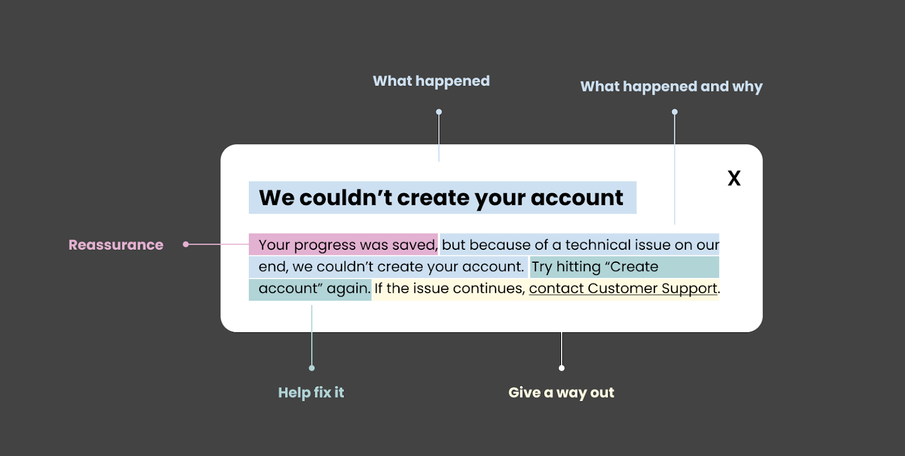

# Storybook Errors

Storybook provides a utility to manage errors thrown from it. Storybook errors reside in this package and are categorized into:

1. **[Preview errors](./preview-errors.ts)**
   - Errors which occur in the preview area of Storybook
   - e.g. Rendering issues, etc.
   - available in `@storybook/core-events/preview-errors`
2. **[Manager errors](./manager-errors.ts)**
   - Errors which occur in the manager area of Storybook
   - e.g. Sidebar, addons, Storybook UI, Storybook router, etc.
   - available in `@storybook/core-events/manager-errors`
3. **[Server errors](./server-errors.ts)**
   - Any Errors that happen in node
   - e.g. Storybook init command, building in prod, building in dev, etc.
   - available in `@storybook/core-events/server-errors`

## How to create errors

First, find which file your error should be part of, based on the criteria above.
Second use the `defineError` function to define custom errors with specific codes and categories for use within the Storybook codebase. Below is the detailed API documentation for this function:

### Function Signature

```typescript
export function defineError<Template extends string | ((...data: any[]) => string)>({
  category: Category;
  code: number;
  template: Template;
  documentation?: boolean | string;
  telemetry?: boolean;
}): {
  code: number;
  category: Category;
  error: (...data: Data) => StorybookError;
}
```

### Parameters

| Name           | Type                                          | Description                                                                                                                                                |
| -------------- | --------------------------------------------- | ---------------------------------------------------------------------------------------------------------------------------------------------------------  |
| category       | `Category`                                    | The category to which the error belongs.                                                                                                                   |
| code           | `number`                                      | The numeric code for the error.                                                                                                                            |
| template       | `string` or `(...data: any[]) => string`      | A properly written error message or a function that takes data arguments and returns an error, for dynamic messages message.                               |
| documentation  | `boolean` or `string`                         | Optional. Should be set to `true` **if the error is documented on the Storybook website**. If defined as string, it should be a custom documentation link. |
| telemetry      | `boolean`                                     | Optional. If set to `true`, telemetry will be used to send errors. **Only for client based errors**.                                                       |

### Return Value

The function returns an object containing the following properties:

| Name           | Type                                | Description                                                                                    |
| -------------- | ----------------------------------- | ---------------------------------------------------------------------------------------------- |
| code           | `number`                            | The numeric code for the defined error.                                                        |
| category       | `Category`                          | The category of the defined error.                                                             |
| error          | `(...data: Data) => StorybookError` | A function that generates the error message based on the provided template and data arguments. |


## Usage Example

```typescript
// Define a custom error with a numeric code and a static error message template.
const simpleError = defineError({
  category: Category.Generic,
  code: 1,
  template: 'Something went wrong. Please try again later.',
  telemetry: true,
});

// Use the defined error with custom data arguments.
const dataError = defineError({
  category: Category.Validation,
  code: 2,
  template: (fieldName: string) => `Invalid value provided for ${fieldName}.`,
  documentation: 'https://some-custom-documentation.com/validation-errors',
});

// "[SB_Generic_0001] Something went wrong. Please try again later.
throw simpleError.error();

// "[SB_Validation_0002] Invalid value provided for username. More info: https://some-custom-documentation.com/validation-errors"
throw dataError.error('username');
```

## How to write a proper error message

Writing clear and informative error messages is crucial for effective debugging and troubleshooting. A well-crafted error message can save developers and users valuable time. Consider the following guidelines:

- **Be clear and specific:** Provide straightforward error messages that precisely describe the issue.
- **Include relevant context:** Add details about the error's origin and relevant context to aid troubleshooting.
- **Provide guidance for resolution:** Offer actionable steps to resolve the error or suggest potential fixes.
- **Provide documentation links:** Whenever applicable, provide links for users to get guidance or more context to fix their issues.



✅ Here are a few recommended examples:

Long:
```
Couldn't find story matching 'xyz' after HMR.
  - Did you just rename a story?
  - Did you remove it from your CSF file?
  - Are you sure a story with that id exists?
  - Please check the stories field of your main.js config.
  - Also check the browser console and terminal for potential error messages.
```

Medium:
```
Addon-docs no longer uses configureJsx or mdxBabelOptions in 7.0.

To update your configuration, please see migration instructions here:

https://github.com/storybookjs/storybook/blob/next/MIGRATION.md#dropped-addon-docs-manual-babel-configuration
```

Short:
```
Failed to initialize Storybook.

Do you have an error in your \`preview.js\`? Check your Storybook's browser console for errors.
```

❌ Here are a few unrecommended examples:

```
outputDir is required
```

```
Cannot render story
```

```
no builder configured!
```