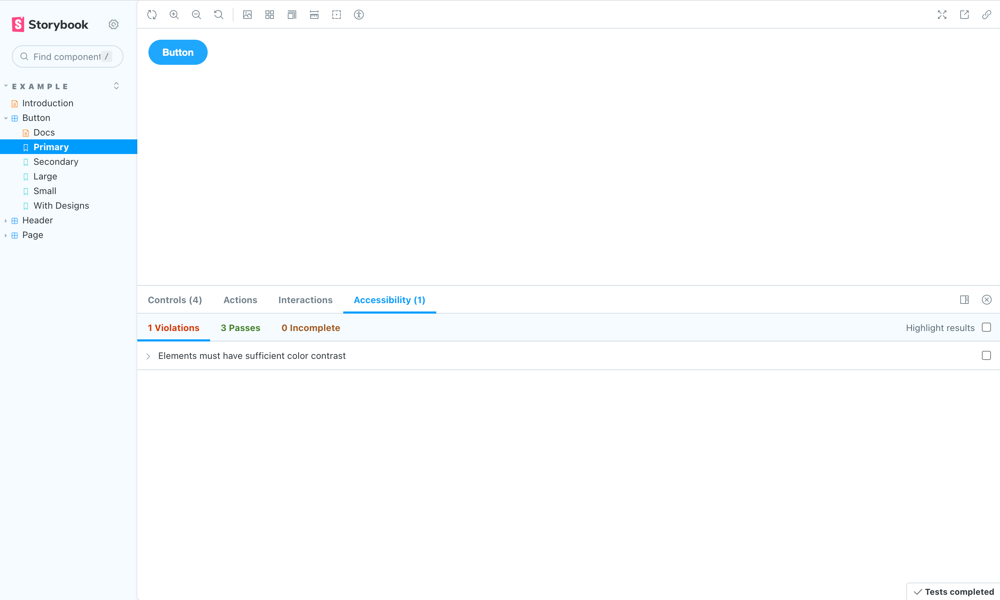

Storybook has [hundreds of reusable addons](https://storybook.js.org/integrations) packaged as NPM modules. Let's walk through how to extend Storybook by installing and registering addons.

## Automatic installation

Storybook includes a [`storybook add`](../api/cli-options.md#add) command to automate the setup of addons. Several community-led addons can be added using this command, except for preset addons. We encourage you to read the addon's documentation to learn more about its installation process.

Run the `storybook add` command using your chosen package manager, and the CLI will update your Storybook configuration to include the addon and install any necessary dependencies.

<!-- prettier-ignore-start -->

<CodeSnippets
  paths={[
    'common/storybook-add-command.yarn.js.mdx',
    'common/storybook-add-command.npm.js.mdx',
    'common/storybook-add-command.pnpm.js.mdx',
  ]}
/>

<!-- prettier-ignore-end -->

<Callout variant="warning">

If you're attempting to install multiple addons at once, it will only install the first addon that was specified. This is a known limitation of the current implementation and will be addressed in a future release.

</Callout>

### Manual installation

Storybook addons are always added through the [`addons`](../api/main-config-addons.md) configuration array in [`.storybook/main.js|ts`](../configure/index.md). The following example shows how to manually add the [Accessibility addon](https://storybook.js.org/addons/@storybook/addon-a11y) to Storybook.

Run the following command with your package manager of choice to install the addon.

<!-- prettier-ignore-start -->

<CodeSnippets
  paths={[
    'common/storybook-a11y-install.yarn.js.mdx',
    'common/storybook-a11y-install.npm.js.mdx',
    'common/storybook-a11y-install.pnpm.js.mdx',
  ]}
/>

<!-- prettier-ignore-end -->

Next, update `.storybook/main.js|ts` to the following:

<!-- prettier-ignore-start -->

<CodeSnippets
  paths={[
    'common/storybook-a11y-register.js.mdx',
    'common/storybook-a11y-register.ts.mdx',
  ]}
/>

<!-- prettier-ignore-end -->

When you run Storybook, the accessibility testing addon will be enabled.

### Removing addons

To remove an addon from Storybook, you can choose to manually uninstall it and remove it from the configuration file (i.e., [`.storybook/main.js|ts`](../configure/index.md)) or opt-in to do it automatically via the CLI with the [`remove`](../api/cli-options.md#remove) command. For example, to remove the [Accessibility addon](https://storybook.js.org/addons/@storybook/addon-a11y) from Storybook with the CLI, run the following command:

<!-- prettier-ignore-start -->

<CodeSnippets
  paths={[
    'common/storybook-remove-command.yarn.js.mdx',
    'common/storybook-remove-command.npm.js.mdx',
    'common/storybook-remove-command.pnpm.js.mdx',
  ]}
/>

<!-- prettier-ignore-end -->

## Using preset addons

Storybook preset addons are grouped collections of specific `babel`, `webpack` and `addons` configurations for distinct use cases. Each one has its own set of instructions. Preset addons have a three-step installation process: install, register, and optionally configure.

For example, to use SCSS styling, run the following command to install the addon and the required dependencies:

<!-- prettier-ignore-start -->

<CodeSnippets
  paths={[
    'common/storybook-preset-scss.npm.js.mdx',
    'common/storybook-preset-scss.yarn.js.mdx',
    'common/storybook-preset-scss.pnpm.js.mdx',
  ]}
/>

<!-- prettier-ignore-end -->

<Callout variant="info" icon="💡">

This preset addon is currently deprecated and no longer maintained. It's only mentioned here for example purposes. If you want to use SCSS styling in your project, we recommend using [@storybook/addon-styling-webpack](https://storybook.js.org/addons/@storybook/addon-styling-webpack/) addon for Webpack based projects or the [@storybook/addon-themes](https://storybook.js.org/addons/@storybook/addon-themes) for a framework agnostic solution.

</Callout>

Next, update [`.storybook/main.js|ts`](../configure/index.md) to the following:

<!-- prettier-ignore-start -->

<CodeSnippets
  paths={[
    'common/storybook-main-preset-config.js.mdx',
    'common/storybook-main-preset-config.ts.mdx',
  ]}
/>

<!-- prettier-ignore-end -->

When you run Storybook, it will configure itself to use SCSS styling. No further configuration is needed.

#### Optional configuration

Most preset addons can also take additional parameters. The most common use cases are:

- Addon configuration
- Webpack loader configuration

Consider the following example:

<!-- prettier-ignore-start -->

<CodeSnippets
  paths={[
    'common/storybook-preset-configuration.js.mdx',
    'common/storybook-preset-configuration.ts.mdx',
  ]}
/>

<!-- prettier-ignore-end -->

<Callout variant="info">

Preset addons may also have addon-specific configurations. We encourage you to read their respective documentation to learn more about their configuration options.

</Callout>

When Storybook starts, it will update Webpack's CSS loader to use modules and adjust how styling is defined.
