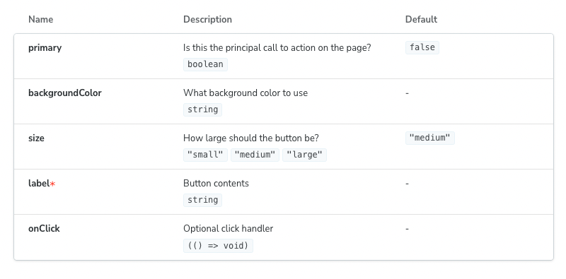

This API is experimental and may change outside of the typical semver release cycle

ArgTypes are a first-class feature in Storybook for specifying the behaviour of [Args](../writing-stories/args.md). By specifying the type of an arg, you constrain the values that it can take and provide information about args that are not explicitly set (i.e., not required).

You can also use argTypes to “annotate” args with information used by addons that make use of those args. For instance, to instruct the controls addon to render a color, you could choose a string-valued arg.

The most concrete realization of argTypes is the [`ArgTypes` doc block](./doc-block-argtypes.md) ([`Controls`](./doc-block-controls.md) is similar). Each row in the table corresponds to a single argType and the current value of that arg.

## Automatic argType inference

If you are using the Storybook [docs](../writing-docs/introduction.md) addon (installed by default as part of [essentials](../essentials/introduction.md)), then Storybook will infer a set of argTypes for each story based on the `component` specified in the [default export](./csf.md#default-export) of the CSF file.

To do so, Storybook uses various static analysis tools depending on your framework.

- React
  - [react-docgen](https://github.com/reactjs/react-docgen)
  - [react-docgen-typescript](https://github.com/styleguidist/react-docgen-typescript)
- Vue
  - [vue-docgen-api](https://github.com/vue-styleguidist/vue-styleguidist/tree/dev/packages/vue-docgen-api)
- Angular
  - [compodoc](https://compodoc.app/)
- WebComponents
  - [custom-element.json](https://github.com/webcomponents/custom-elements-json)
- Ember
  - [YUI doc](https://github.com/ember-learn/ember-cli-addon-docs-yuidoc#documenting-components)

The format of the generated argType will look something like this:

<!-- prettier-ignore-start -->

<CodeSnippets
  paths={[
    'common/storybook-generated-argtypes.js.mdx',
  ]}
/>

<!-- prettier-ignore-end -->

This ArgTypes data structure, name, type, defaultValue, and description are standard fields in all ArgTypes (analogous to PropTypes in React). The table and control fields are addon-specific annotations. So, for example, the table annotation provides extra information to customize how the label gets rendered, and the control annotation includes additional information for the control editing the property.

## Manual specification

If you want more control over the args table or any other aspect of using argTypes, you can overwrite the generated argTypes for your component on a per-arg basis. For instance, with the above-inferred argTypes and the following default export:

💡 As with other Storybook properties (e.g., args, decorators), you can also override ArgTypes per story basis.

<!-- prettier-ignore-start -->

<CodeSnippets
  paths={[
    'common/storybook-customize-argtypes.js.mdx',
    'common/storybook-customize-argtypes.ts.mdx',
  ]}
/>

<!-- prettier-ignore-end -->

The `values.description`, `table.type`, and `controls.type` are merged into the defaults extracted by Storybook. The final merged values would be:

<!-- prettier-ignore-start -->

<CodeSnippets
  paths={[
    'common/storybook-merged-argtypes.js.mdx',
  ]}
/>

<!-- prettier-ignore-end -->

In particular, this would render a row with a modified description, a type display with a dropdown that shows the detail, and no control.

### Available properties

Here's an explanation of each available property:

| Property                     | Description                                                                                                                                                                                        |
| ---------------------------- | -------------------------------------------------------------------------------------------------------------------------------------------------------------------------------------------------- |
| `name`                       | The name of the property.   `argTypes: { label: { name: 'Something' } }`                                                                                                                       |
| `type.name`                  | Sets a type for the property.   `argTypes: { label: { type: { name: 'number' } } }`                                                                                                            |
| `type.required`              | Sets the property as optional or required.   `argTypes: { label: { type: { required: true } }`                                                                                                 |
| `description`                | Sets a Markdown description for the property.   `argTypes: { label: { description: 'Something' } }`                                                                                            |
| `table.type.summary`         | Provide a short version of the type.   `argTypes: { label: { table: { type: { summary: 'a short summary' } }}}`                                                                                |
| `table.type.detail`          | Provides an extended version of the type.   `argTypes: { label: { table: { type: { detail: 'something' } }}}`                                                                                  |
| `table.defaultValue.summary` | Provide a short version of the default value.   `argTypes: { label: { table: { defaultValue: { summary: 'Hello World' } }}}`                                                                   |
| `table.defaultValue.detail`  | Provides a longer version of the default value.   `argTypes: { label: { table: { defaultValue: { detail: 'Something' } }}}`                                                                    |
| `control`                    | Associates a control for the property.   `argTypes: { label: { control: { type: 'text'} } }`  Read the [Essentials documentation](../essentials/controls.md) to learn more about controls. |

#### Shorthands

💡 The `@storybook/addon-docs` provide a shorthand for common tasks:

- `type: 'number'` is shorthand for type: { name: 'number' }
- `control: 'radio'` is shorthand for control: { type: 'radio' }

### Grouping

You can also manually specify groups to organize related `argTypes` into categories or even subcategories. Based on the following component implementation:

<!-- prettier-ignore-start -->

<CodeSnippets
  paths={[
    'react/button-implementation.js.mdx',
    'react/button-implementation.ts.mdx',
    'angular/button-implementation.ts.mdx',
    'vue/button-implementation.2.js.mdx',
    'vue/button-implementation.ts-2.ts.mdx',
    'vue/button-implementation.3.js.mdx',
    'vue/button-implementation.ts-3.ts.mdx',
    'svelte/button-implementation.js.mdx',
    'web-components/button-implementation.js.mdx',
    'web-components/button-implementation.ts.mdx',
  ]}
/>

<!-- prettier-ignore-end -->

You could group similar properties for better organization and structure. Using the table below as a reference:

| Field               | Category |
| :------------------ | :------: |
| **backgroundColor** |  Colors  |
| **primary**         |  Colors  |
| **label**           |   Text   |
| **onClick**         |  Events  |
| **size**            |  Sizes   |

Results in the following change into your story and UI.

<!-- prettier-ignore-start -->

<CodeSnippets
  paths={[
    'common/button-story-argtypes-with-categories.js.mdx',
    'common/button-story-argtypes-with-categories.ts.mdx',
  ]}
/>

<!-- prettier-ignore-end -->

You can also extend the formula above and introduce subcategories, allowing better structuring and organization. Using the table below as a reference leads to the following change to your story and UI:

| Field               | Category |   Subcategory   |
| :------------------ | :------: | :-------------: |
| **backgroundColor** |  Colors  |  Button colors  |
| **primary**         |  Colors  |  Button style   |
| **label**           |   Text   | Button contents |
| **onClick**         |  Events  |  Button Events  |
| **size**            |  Sizes   |                 |

<!-- prettier-ignore-start -->

<CodeSnippets
  paths={[
    'common/button-story-argtypes-with-subcategories.js.mdx',
    'common/button-story-argtypes-with-subcategories.ts.mdx',
  ]}
/>

<!-- prettier-ignore-end -->

#### Global `argTypes`

You can also define arg types at the global level; they will apply to every component's stories unless you overwrite them. To do so, export the `argTypes` key in your `preview.js`:

<!-- prettier-ignore-start -->

<CodeSnippets
  paths={[
    'common/button-story-project-args-theme.js.mdx',
    'common/button-story-project-args-theme.ts.mdx',
  ]}
/>

<!-- prettier-ignore-end -->

💡 If you define a global arg type for a story that does not have that arg (e.g. if there is no corresponding global arg definition), then the arg type will have no effect.

#### Using argTypes in addons

If you want to access the argTypes of the current component inside an addon, you can use the `useArgTypes` hook from the `@storybook/manager-api` package:

<!-- prettier-ignore-start -->

<CodeSnippets
  paths={[
    'common/storybook-argtypes-with-addon.js.mdx',
  ]}
/>

<!-- prettier-ignore-end -->
