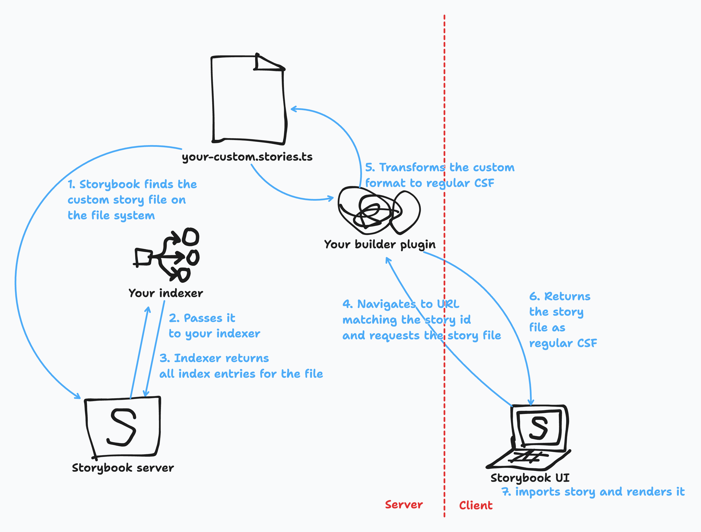

(⚠️ **Experimental**)

<div class="aside">

🧪 While this feature is experimental, it must be specified by the `experimental_indexers` property of [`StorybookConfig`](./main-config.md).

</div>

Parent: [main.js|ts configuration](./main-config.md)

Type: `(existingIndexers: Indexer[]) => Promise<Indexer[]>`

Indexers are responsible for building Storybook's index of stories—the list of all stories and a subset of their metadata like `id`, `title`, `tags`, and more. The index can be read at the `/index.json` route of your Storybook.

The indexers API is an advanced feature that allows you to customize Storybook's indexers, which dictate how Storybook indexes and parses files into story entries. This adds more flexibility to how you can write stories, including which language stories are defined in or where to get stories from.

They are defined as a function that returns the full list of indexers, including the existing ones. This allows you to add your own indexer to the list, or to replace an existing one:

<!-- prettier-ignore-start -->

<CodeSnippets
  paths={[
    'common/main-config-indexers.js.mdx',
    'common/main-config-indexers.ts.mdx',
  ]}
/>

<!-- prettier-ignore-end -->

Unless your indexer is doing something relatively trivial (e.g. [indexing stories with a different naming convention](../configure/sidebar-and-urls#story-indexers)), in addition to indexing the file, you will likely need to [transpile it to CSF](#transpiling-to-csf) so that Storybook can read them in the browser.

## `Indexer`

Type:

```ts
{
  test: RegExp;
  createIndex: (fileName: string, options: IndexerOptions) => Promise<IndexInput[]>;
}
```

Specifies which files to index and how to index them as stories.

### `test`

(Required)

Type: `RegExp`

A regular expression run against file names included in the [`stories`](./main-config-stories.md) configuration that should match all files to be handled by this indexer.

### `createIndex`

(Required)

Type: `(fileName: string, options: IndexerOptions) => Promise<IndexInput[]>`

Function that accepts a single CSF file and returns a list of entries to index.

#### `fileName`

Type: `string`

The name of the CSF file used to create entries to index.

#### `IndexerOptions`

<!-- TODO: Rename to IndexFnOptions? Or another word than "options"? IndexFnHelpers? -->

Type:

```ts
{
  makeTitle: (userTitle?: string) => string;
}
```

Options for indexing the file.

##### `makeTitle`

Type: `(userTitle?: string) => string`

A function that takes a user-provided title and returns a formatted title for the index entry, which is used in the sidebar.

See [`IndexInput.title`](#title) for example usage.

#### `IndexInput`

Type:

```ts
{
  exportName: string;
  importPath: string;
  type: 'story';
  metaId?: string;
  name?: string;
  tags?: string[];
  title?: string;
  __id?: string;
}
```

An object representing a story to be added to the stories index.

##### `exportName`

(Required)

Type: `string`

For each `IndexInput`, the indexer will add this export (from the file found at `importPath`) as an entry in the index.

##### `importPath`

(Required)

Type: `string`

The file to import from, e.g. the [CSF](./csf.md) file.

It is likely that the [`fileName`](#filename) being indexed is not CSF, in which you will need to [transpile it to CSF](#transpiling-to-csf) so that Storybook can read it in the browser.

##### `type`

(Required)

Type: `'story'`

The type of entry.

##### `metaId`

Type: `string`

Default: Auto-generated from [`title`](#title)

Define the custom id for meta of the entry.

If specified, the export default (meta) in the CSF file _must_ have a corresponding `id` property, to be correctly matched.

##### `name`

Type: `string`

Default: Auto-generated from [`exportName`](#exportname)

The name of the entry.

##### `tags`

Type: `string[]`

Tags for filtering entries in Storybook and its tools.

##### `title`

Type: `string`

Default: Auto-generated from default export of [`importPath`](#importpath)

Determines the location of the entry in the sidebar.

Most of the time, you should **not** specify a title, so that your indexer will use the default naming behavior. When specifying a title, you **must** use the [`makeTitle`](#maketitle) function provided in [`IndexerOptions`](#indexeroptions) to also use this behavior. For example, here's an indexer that merely appends a "Custom" prefix to the title derived from the file name:

<!-- TODO: Turn this into a proper snippet (don't forget the `ts-4-9` version!): -->

<!-- prettier-ignore-start -->

<!--
<CodeSnippets
  paths={[
    'common/main-config-indexers-title.js.mdx',
    'common/main-config-indexers-title.ts.mdx',
  ]}
/>
-->

<!-- prettier-ignore-end -->

```ts
// .storybook/main.ts

// Replace your-framework with the framework you are using (e.g., react-webpack5, vue3-vite)
import type { StorybookConfig, Indexer } from '@storybook/your-framework';

const combosIndexer: Indexer = {
  test: /\.stories\.[tj]sx?$/,
  createIndex: async (fileName, { makeTitle }) => {
    // 👇 Grab title from fileName
    const title = fileName.match(/\/(.*)\.stories/)[1];

    // Read file and generate entries ...

    return entries.map((entry) => ({
      type: 'story',
      // 👇 Use makeTitle to format the title
      title: `${makeTitle(title)} Custom`,
      importPath: fileName,
      exportName: entry.name,
    }));
  },
};

const config: StorybookConfig = {
  framework: '@storybook/your-framework',
  stories: ['../src/**/*.mdx', '../src/**/*.stories.@(js|jsx|ts|tsx)'],
  experimental_indexers: async (existingIndexers) => [...existingIndexers, combosIndexer];
};

export default config;
```

##### `__id`

Type: `string`

Default: Auto-generated from [`title`](#title)/[`metaId`](#metaid) and [`exportName`](#exportname)

Define the custom id for the story of the entry.

If specified, the story in the CSF file **must** have a corresponding `__id` property, to be correctly matched.

Only use this if you need to override the auto-generated id.

## Transpiling to CSF

The value of [`importPath`](#importpath) in an [`IndexInput`](#indexinput) must resolve to a [CSF](./csf.md) file. Most custom indexers, however, are only necessary because the input is _not_ CSF. Therefore, you will likely need to transpile the input to CSF, so that Storybook can read it in the browser and render your stories.

Transpiling the custom source format to CSF is beyond the scope of this documentation. This transpilation is often done at the builder level ([Vite](../builders/vite.md) and/or [Webpack](../builders/webpack.md)), and we recommend using [unplugin](https://github.com/unjs/unplugin) to create plugins for multiple builders.

The general architecture looks something like this:

<!-- TODO: If diagram is useful, make a real one -->



First, here's an example of a source file:

```ts
// ./Button.variants.ts

import { variantsFromComponent, createStoryFromVariant } from '../utils';
import { Button } from './Button';

/**
 * Returns raw strings representing stories via component props, eg.
 * 'export const PrimaryVariant = {
 *    args: {
 *      primary: true
 *    },
 *  };'
 */
export const generateStories = () => {
  const variants = variantsFromComponent(Button);
  return variants.map((variant) => createStoryFromVariant(variant));
};
```

The builder plugin would then:

1. Receive and read the source file
2. Import the exported `generateStories` function
3. Run the function to generate the stories
4. Write the stories to a CSF file

That resulting CSF file would then be indexed by Storybook. It would something look like this:

```js
// virtual:./Button.variants

import { Button } from './Button';

export default {
  component: Button,
};

export const Primary = {
  args: {
    primary: true,
  },
};
```

### Examples

Some example usages of custom indexers include:

<details open>

<summary>Generating stories dynamically from fixture data or API endpoints</summary>

This indexer generates stories for components based on JSON fixture data. It looks for `jsonstories.js|jsx|ts|tsx` files in the project and then for each such file, looks for `.json` files in the same directory, each of which is added as a story.

<!--
TODO:
1. Update snippet to turn one input .json file into multiple components w/ multiple stories
2. Add a code block (doesn't need to be a proper snippet) for an example input .json file
3. Spell out steps needed in the build plugin to transpile to CSF
4. Turn this into a proper snippet (don't forget the `ts-4-9` version!):
-->

<!-- prettier-ignore-start -->

<!--
<CodeSnippets
  paths={[
    'common/main-config-indexers-jsonfixture.js.mdx',
    'common/main-config-indexers-jsonfixture.ts.mdx',
  ]}
/>
-->

<!-- prettier-ignore-end -->

```ts
// .storybook/main.ts

// Replace your-framework with the framework you are using (e.g., react-webpack5, vue3-vite)
import type { StorybookConfig, Indexer } from '@storybook/your-framework';

import fs from 'fs/promises';
import path from 'path';

const jsonFixtureIndexer: Indexer = {
  test: /jsonstories\.[tj]sx?$/,
  createIndex: async (fileName) => {
    // JSON files in the current directory
    const jsonFiles = (await fs.readdir(path.dirname(fileName)))
      .filter(f => f.endsWith('.json'))

    // Sidebar entries for each file
    return jsonFiles
      .map(jsonFile => ({
        type: 'story',
        importPath: fileName,
        exportName: f.split('.')[0]
      }));
  },
};

const config: StorybookConfig = {
  framework: '@storybook/your-framework',
  stories: [
    '../src/**/*.mdx',
    '../src/**/*.stories.@(js|jsx|mjs|ts|tsx)',
    // 👇 Make sure files to index are included in `stories`
    '../src/**/*.jsonstories.@(js|jsx|mjs|ts|tsx)',
  ],
  experimental_indexers: async (existingIndexers) => [...existingIndexers, jsonFixtureIndexer];
};

export default config;
```

</details>

<details>

<summary>Generating stories based on custom combinatorial logic</summary>

This is an indexer in a fictional addon that provides combinatorial testing for files that end with `.combos.js|jsx|ts|tsx`. It generates extra named exports (stories) of the form `Combo0 ... ComboN` for each combination of args.

<!--
TODO:
1. Update snippet to be more clear, in general
2. Add a code block (doesn't need to be a proper snippet) for an example input .combos.ts file
3. Spell out steps needed in the build plugin to transpile to CSF
4. Import Indexer type from where?
5. Turn this into a proper snippetTurn this into a proper snippet (don't forget the `ts-4-9` version!):
-->

<!-- prettier-ignore-start -->

<!--
<CodeSnippets
  paths={[
    'common/main-config-indexers-combos.js.mdx',
    'common/main-config-indexers-combos.ts.mdx',
  ]}
/>
-->

<!-- prettier-ignore-end -->

```ts
// addon-arg-combos/preset.ts

// Replace your-framework with the framework you are using (e.g., react-webpack5, vue3-vite)
import type { Indexer } from '@storybook/your-framework';

import fs from 'fs/promises';
import path from 'path';

import { parseCombos } from '../utils';

const combosIndexer: Indexer = {
  test: /\.combos\.[tj]sx?$/,
  createIndex: async (fileName) => {
    const code = await fs.readFile(fileName);
    const combos = parseCombos(code);

    // Sidebar entries for each file
    return combos.map((combo, idx) => ({
      type: 'story',
      importPath: fileName,
      exportName: `Combo${idx}`,
    }));
  },
};

export default {
  experimental_indexers: (existingIndexers) => [...existingIndexers, combosIndexer],
};
```

</details>

<details>

<summary>Defining stories in template languages like Vue or Svelte native syntax instead of CSF</summary>

<!-- TODO: Unclear what this example would entail -->

</details>
