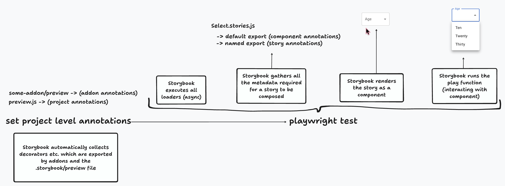

export const SUPPORTED_RENDERERS = ['react', 'vue'];

(⚠️ **Experimental**)

<If notRenderer={SUPPORTED_RENDERERS}>

<Callout variant="info">

Portable stories are currently only supported in [React](?renderer=react) and [Vue](?renderer=vue) projects.

</Callout>

<!-- End non-supported renderers -->

</If>

<If renderer={SUPPORTED_RENDERERS}>

Portable stories are Storybook [stories](../writing-stories/index.md) which can be used in external environments, such as [Playwright Component Tests (CT)](https://playwright.dev/docs/test-components).

Normally, Storybok composes a story and its [annotations](#annotations) automatically, as part of the [story pipeline](#story-pipeline). When using stories in Playwright CT, you can use the [`createTest`](#createtest) function, which extends Playwright's test functionality to add a custom `mount` mechanism, to take care of the story pipeline for you.

## createTest

(⚠️ **Experimental**)

Instead of using Playwright's own `test` function, you can use Storybook's special `createTest` function which will extend Playwright's test functionality to add a custom `mount` mechanism which will load, render, and play the story. This function is experimental and is subject to changes.

<!-- prettier-ignore-start -->

<CodeSnippets
  paths={[
    'react/portable-stories-playwright-ct.ts.mdx',
    'vue/portable-stories-playwright-ct.ts.mdx',
  ]}
/>

<!-- prettier-ignore-end -->

<Callout variant="warning">

Please note the [limitations of importing stories in Playwright CT](#importing-stories-in-playwright-ct).

</Callout>

### Type

```ts
createTest(
  baseTest: TK
) => TK
```

### Parameters

#### `baseTest`

(**Required**)

Type: `TK`

The base test function to use, e.g. `test` from Playwright.

### Return

Type: `TK`

A Storybook-specific test function with the custom `mount` mechanism.

## setProjectAnnotations

This API should be called once, before the tests run, in [`playwright/index.ts`](https://playwright.dev/docs/test-components#step-1-install-playwright-test-for-components-for-your-respective-framework). This will make sure that when `mount` is called, the project annotations are taken into account as well.

```ts
// playwright/index.ts
// Replace <your-renderer> with your renderer, e.g. react, vue3
import { setProjectAnnotations } from '@storybook/<your-renderer>';
import * as addonAnnotations from 'my-addon/preview';
import sbAnnotations from '../.storybook/preview';

setProjectAnnotations([sbAnnotations, addonAnnotations]);
```

<Callout variant="warning">

Sometimes a story can require an addon's [decorator](../writing-stories/decorators.md) to render properly. For example, an addon can apply a decorator that wraps your story in the necessary router context. In this case, you must include that addon's `preview` export in the project annotations set.

</Callout>

### Type

```ts
(projectAnnotations: ProjectAnnotation | ProjectAnnotation[]) => void
```

### Parameters

#### `projectAnnotations`

(**Required**)

Type: `ProjectAnnotation | ProjectAnnotation[]`

A set of project [annotations](#annotations) (those defined in `.storybook/preview.js|ts`) or an array of sets of project annotations, which will be applied to all composed stories.

## Annotations

Annotations are the metadata applied to a story, like [args](../writing-stories/args.md), [decorators](../writing-stories/decorators.md), [loaders](../writing-stories/loaders.md), and [play functions](../writing-stories/play-function.md). They can be defined for a specific story, all stories for a component, or all stories in the project.

## Importing stories in Playwright CT

The code which you write in your Playwright test file is transformed and orchestrated by Playwright, where part of the code executes in Node, while other parts execute in the browser.

Because of this, you have to compose the stories _in a separate file than your own test file_:

```ts
// Button.portable.ts
// Replace <your-renderer> with your renderer, e.g. react, vue3
import { composeStories } from '@storybook/<your-renderer>';

import * as stories from './Button.stories';

// This function will be executed in the browser
// and compose all stories, exporting them in a single object
export default composeStories(stories);
```

You can then import the composed stories in your Playwright test file, as in the [example above](#createtest).

<Callout variant="info">

[Read more about Playwright's component testing](https://playwright.dev/docs/test-components#test-stories).

</Callout>

## Story pipeline

To preview your stories, Storybook runs a story pipeline, which includes applying project annotations, loading data, rendering the story, and playing interactions. This is a simplified version of the pipeline:



When you want to reuse a story in a different environment, however, it's crucial to understand that all these steps make a story. The portable stories API provides you with the mechanism to recreate that story pipeline in your external environment:

### 1. Apply project-level annotations

[Annotations](#annotations) come from the story itself, that story's component, and the project. The project-level annotatations are those defined in your `.storybook/preview.js` file and by addons you're using. In portable stories, these annotations are not applied automatically—you must apply them yourself.

👉 For this, you use the [`setProjectAnnotations`](#setprojectannotations) API.

### 2. Prepare, load, render, and play

The story pipeline includes preparing the story, [loading data](../writing-stories/loaders.md), rendering the story, and [playing interactions](../essentials/interactions.md#play-function-for-interactions). In portable stories within Playwright CT, the `mount` function takes care of these steps for you.

👉 For this, you use the [`createTest`](#createtest) API.

<Callout variant="info">

If your play function contains assertions (e.g. `expect` calls), your test will fail when those assertions fail.

</Callout>

## Overriding globals

If your stories behave differently based on [globals](../essentials/toolbars-and-globals.md#globals) (e.g. rendering text in English or Spanish), you can define those global values in portable stories by overriding project annotations when composing a story:

<!-- prettier-ignore-start -->

<CodeSnippets
  paths={[
    'react/portable-stories-override-globals.ts.mdx',
    'vue/portable-stories-override-globals.ts.mdx',
  ]}
/>

<!-- prettier-ignore-end -->

<!-- End supported renderers -->

</If>
