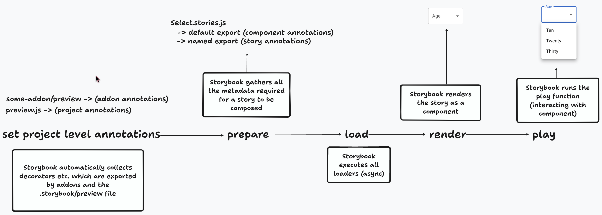

export const SUPPORTED_RENDERERS = ['react', 'vue'];

<If notRenderer={SUPPORTED_RENDERERS}>

<Callout variant="info">

Portable stories are currently only supported in [React](?renderer=react) and [Vue](?renderer=vue) projects.

</Callout>

</If>
{/* End non-supported renderers */}

<If renderer={SUPPORTED_RENDERERS}>

Portable stories are Storybook [stories](../writing-stories/index.md) which can be used in external environments such as in a test (with Vitest, for instance). You can use the [`composeStories`](#composestories) and [`composeStory`](#composestory) functions to compose stories and their [annotations](#annotations), making them portable.

Normally, Storybok composes a story and its annotations automatically, as part of the [story pipeline](#story-pipeline). When using stories outside of Storybook, you must handle the story pipeline yourself.

## composeStories

`composeStories` will process all stories from the component's stories you specify, compose args/decorators in all of them and return an object containing the composed stories.

If you use the composed story (e.g. Primary button), the component will render with the args that are passed in the story. However, you are free to pass any props on top of the component, and those props will override the default values passed in the story's args.

<!-- prettier-ignore-start -->

<CodeSnippets
  paths={[
    'react/portable-stories-compose-stories.ts.mdx',
    'vue/portable-stories-compose-stories.ts.mdx',
  ]}
/>

<!-- prettier-ignore-end -->

### Type

<!-- prettier-ignore-start -->
```ts
(
  csfExports: CSF file exports,
  projectAnnotations?: ProjectAnnotations
) => Record<string, ComposedStoryFn>
```
<!-- prettier-ignore-end -->

### Parameters

#### `csfExports`

(**Required**)

Type: CSF file exports

Specifies which component's stories you want to compose. Pass the **full set of exports** from the CSF file (not the default export!). E.g. `import * as stories from './Button.stories'`

#### `projectAnnotations`

Type: `ProjectAnnotation | ProjectAnnotation[]`

This parameter is provided for convenience. You should likely use [`setProjectAnnotations`](#setprojectannotations) instead. Details about the `ProjectAnnotation` type can be found in that function's [`projectAnnotations`](#projectannotations-2) parameter.

This parameter can be used to [override](#overriding-globals) the project annotations applied via `setProjectAnnotations`.

### Return

Type: `Record<string, ComposedStoryFn>`

An object where the keys are the names of the stories and the values are the composed stories.

Additionally, the composed story will have the following properties:

| Property   | Type                                      | Description                                                     |
| ---------- | ----------------------------------------- | --------------------------------------------------------------- |
| storyName  | `string`                                  | The story's name                                                |
| args       | `Record<string, any>`                     | The story's [args](../writing-stories/args.md)                  |
| argTypes   | `ArgType`                                 | The story's [argTypes](./arg-types.md)                          |
| id         | `string`                                  | The story's id                                                  |
| parameters | `Record<string, any>`                     | The story's [parameters](./parameters.md)                       |
| load       | `() => Promise<void>`                     | Executes all the [loaders](#2-load-optional) for a given story  |
| play       | `(context) => Promise<void> \| undefined` | Executes the [play function](#4-play-optional) of a given story |

## composeStory

You can use `composeStory` if you wish to compose a single story for a component.

<!-- prettier-ignore-start -->

<CodeSnippets
  paths={[
    'react/portable-stories-compose-story.ts.mdx',
    'vue/portable-stories-compose-story.ts.mdx',
  ]}
/>

<!-- prettier-ignore-end -->

### Type

<!-- prettier-ignore-start -->
```ts
(
  story: Story export,
  componentAnnotations: Meta,
  projectAnnotations?: ProjectAnnotations,
  exportsName?: string
) => ComposedStoryFn
```
<!-- prettier-ignore-end -->

### Parameters

#### `story`

(**Required**)

Type: `Story export`

Specifies which story you want to compose.

#### `componentAnnotations`

(**Required**)

Type: `Meta`

The default export from the stories file containing the [`story`](#story).

#### `projectAnnotations`

Type: `ProjectAnnotation | ProjectAnnotation[]`

This parameter is provided for convenience. You should likely use [`setProjectAnnotations`](#setprojectannotations) instead. Details about the `ProjectAnnotation` type can be found in that function's [`projectAnnotations`](#projectannotations-2) parameter.

This parameter can be used to [override](#overriding-globals) the project annotations applied via `setProjectAnnotations`.

#### `exportsName`

Type: `string`

You probably don't need this. Because `composeStory` accepts a single story, it does not have access to the name of that story's export in the file (like `composeStories` does). If you must ensure unique story names in your tests and you cannot use `composeStories`, you can pass the name of the story's export here.

### Return

Type: `ComposedStoryFn`

A single [composed story](#return).

## setProjectAnnotations

This API should be called once and before the tests run, typically in your testing tool's setup file. This will make sure that whenever `composeStories` or `composeStory` are used, the project annotations are taken into account as well.

```ts
// setup-tests.ts
// Replace <your-renderer> with your renderer, e.g. react, vue3
import { setProjectAnnotations } from '@storybook/<your-renderer>';
import * as addonAnnotations from 'my-addon/preview';
import * as previewAnnotations from './.storybook/preview';

setProjectAnnotations([previewAnnotations, addonAnnotations]);
```

### Type

```ts
(projectAnnotations: ProjectAnnotation | ProjectAnnotation[]) => void
```

### Parameters

#### `projectAnnotations`

(**Required**)

Type: `ProjectAnnotation | ProjectAnnotation[]`

A set of project [annotations](#annotations) (those defined in `.storybook/preview.js|ts`) or an array of sets of project annotations, which will be applied to all composed stories.

## Annotations

Annotations are the metadata like [args](../writing-stories/args.md), [decorators](../writing-stories/decorators.md), [loaders](../writing-stories/loaders.md), and [play functions](../writing-stories/play-function.md) that are applied to a story. They can be defined for a specific story, all stories for a component, or for all stories in the project.

## Story pipeline

Storybook has a "pipeline of steps", which occur from loading Storybook up until rendering the component in the browser:



When accessing a story in Storybook, you don't need to think about these steps, but it does help a lot in understanding how things work.

When you want to reuse a story in a different environment, however, it's crucial to understand that all these steps make a story. The portable stories API provides you with the mechanism to recreate that “pipeline” on your external environment.

By using portable stories, you will have to deal with things separately, and handle them in your testing environment mechanisms:

### 1. Prepare

You combine the annotations you need in your project so your components render correctly. That's the global config you set up in your `.storybook/preview.js` file, such as:

- global CSS
- global decorators
- global args
- global loaders

👉 For this, you use the [`setProjectAnnotations`](#setprojectannotations) API.

### 2. Load (optional)

You execute the loaders for a given story, and pass the data down to it. This only applies to stories that use the [loader concept](../writing-stories/loaders.md)

👉 For this, you use the [`composeStories`](#composestories) or [`composeStory`](#composestory) API. The composed Story will return a `load` method to be called **before** it is rendered.

For example, your story might have a loader that prepares data for your story, such as setting up some mocks or fetching data which is available via the `loaded` property in the story context. In portable stories, the loaders are not applied automatically – you have to apply them yourself. To do so, you call the `load` method from your composed story before rendering your story.

<!-- prettier-ignore-start -->

<CodeSnippets
  paths={[
    'react/portable-stories-with-loaders.ts.mdx',
    'vue/portable-stories-with-loaders.ts.mdx',
  ]}
/>

<!-- prettier-ignore-end -->

### 3. Render

The story has been prepared and can be rendered. You pass it into the rendering mechanism of your choice (e.g. Testing Library render function, Vue test utils mount function, etc.)

👉 For this, you use the [`composeStories`](#composestories) or [`composeStory`](#composestory) API. The composed Story is a renderable component that can be passed to your rendering mechanism.

### 4. Play (optional)

Once the component is rendered, you execute the play function which will contain interactions and assertions. This only applies for stories that use the [play function](../essentials/interactions.md#play-function-for-interactions).

👉 For this, you use the [`composeStories`](#composestories) or [`composeStory`](#composestory) API. The composed Story will return a `play` method to be called **after** it has rendered.

For example, your story might have a play function that prepares your component's desired state: in this case, clicking on a button to display a modal. In portable stories, the play function does not run automatically – you have to call it yourself. The play function needs a `canvasElement`, which should be passed by you. A `canvasElement` is the HTML element which wraps your component. Each testing utility provides different ways to retrieve such element, but here's how to do it with Testing Library:

<!-- prettier-ignore-start -->

<CodeSnippets
  paths={[
    'react/portable-stories-with-play-function.ts.mdx',
    'vue/portable-stories-with-play-function.ts.mdx',
  ]}
/>

<!-- prettier-ignore-end -->

<Callout variant="info">

If your play function contains assertions (e.g. `expect` calls), your test will fail when those assertions fail.

</Callout>

## Overriding globals

If your stories behave differently based on [globals](../essentials/toolbars-and-globals.md#globals), such as they render text in English or Spanish, and such behavior can be changed via the toolbar items, you can achieve similar functionality in portable stories by overriding project annotations when composing a story:

<!-- prettier-ignore-start -->

<CodeSnippets
  paths={[
    'react/portable-stories-override-globals.ts.mdx',
    'vue/portable-stories-override-globals.ts.mdx',
  ]}
/>

<!-- prettier-ignore-end -->

## Component testing integrations

### Playwright CT

Portable stories work in [Playwright CT](https://playwright.dev/docs/test-components), although with a few modifications, as well as different mounting mechanism.

To set the annotations, you use the `playwright/index.ts` file:

```ts
// playwright/index.ts
// Replace <your-renderer> with your renderer, e.g. react, vue3
import { setProjectAnnotations } from '@storybook/<your-renderer>';
import sbAnnotations from '../.storybook/preview';

setProjectAnnotations(sbAnnotations);
```

To compose stories, however, due to Playwright's limitations\*, you have to compose the stories _in a separate file than your own test file_:

```ts
// Button.playwright.stories.ts
// Replace <your-renderer> with your renderer, e.g. react, vue3
import { composeStories } from '@storybook/<your-renderer>';

import * as stories from './Button.stories';

// This function will be executed in the browser
// and compose all stories, exporting them in a single object
export default composeStories(stories);
```

<Callout variant="warning">

\* The code which you write in your Playwright test file is transformed and orchestrated by Playwright, where part of the code executes in Node, while other parts execute in the browser.

[Read more about Playwright's component testing](https://playwright.dev/docs/test-components#test-stories).

</Callout>

When writing tests, instead of using Playwright's own `test` function, you can use Storybook's special `createTest` function which will extend Playwright's test functionality to add a custom `mount` mechanism which will load, render and play the story. This function is experimental and is subject to changes.

<!-- prettier-ignore-start -->

<CodeSnippets
  paths={[
    'react/portable-stories-playwright-ct.ts.mdx',
    'vue/portable-stories-playwright-ct.ts.mdx',
  ]}
/>

<!-- prettier-ignore-end -->

### Cypress CT

Portable stories work in [Cypress CT](https://docs.cypress.io/guides/component-testing/overview), however there are currently some issues with loaders and play function which we need to investigate further.

To set the annotations, you use the `cypress/support/component.ts` file:

```ts
// cypress/support/component.ts
// Replace <your-renderer> with your renderer, e.g. react, vue3
import { setProjectAnnotations } from '@storybook/<your-renderer>';
import sbAnnotations from '../.storybook/preview';

setProjectAnnotations(sbAnnotations);
```

You can compose stories in your Cypress test file pretty much the same way as in Vitest/Jest:

<!-- prettier-ignore-start -->

<CodeSnippets
  paths={[
    'react/portable-stories-cypress-ct.ts.mdx',
    'vue/portable-stories-cypress-ct.ts.mdx',
  ]}
/>

<!-- prettier-ignore-end -->

The same goes for loaders/play function, you'd have to manually invoke them as such.

<Callout variant="warning">

Cypress doesn't use a normal Promise mechanism so we need to use `cy.then` in order to apply async await for loaders and play function.

</Callout>

<!-- prettier-ignore-start -->

<CodeSnippets
  paths={[
    'react/portable-stories-cypress-ct-async.ts.mdx',
    'vue/portable-stories-cypress-ct-async.ts.mdx',
  ]}
/>

<!-- prettier-ignore-end -->

</If>
{/* End supported renderers */}
