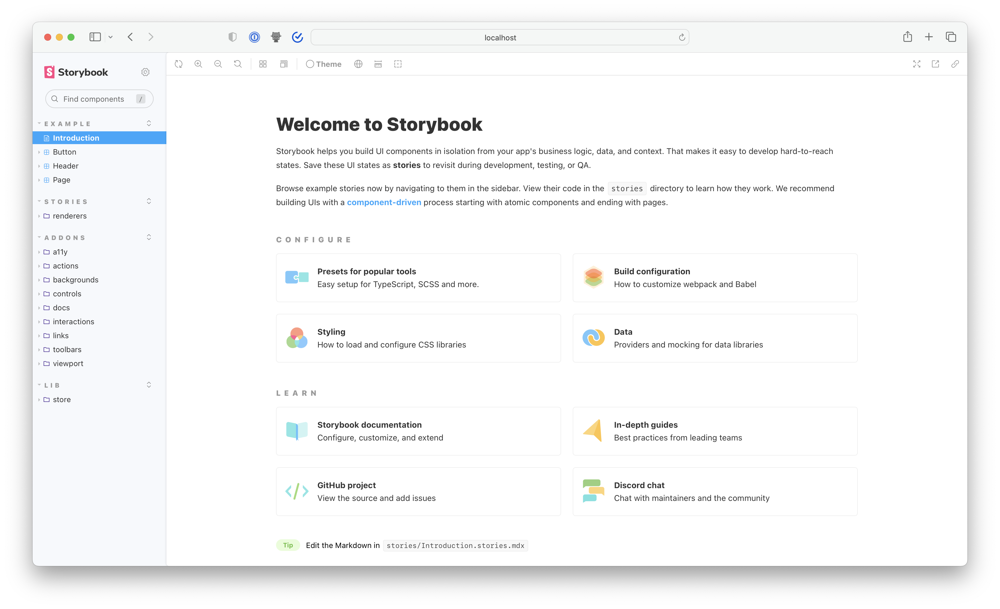

Contribute a new feature or bug fix to [Storybook's monorepo](https://github.com/storybookjs/storybook). This page outlines how to get your environment set up to contribute code.

## Prerequisites

- Ensure you have node version 14 installed (suggestion: v14.18.1).
- Ensure if you are using Windows to use the Windows Subsystem for Linux (WSL).

## Initial setup

Start by [forking](https://docs.github.com/en/github/getting-started-with-github/quickstart/fork-a-repo) the Storybook monorepo and cloning it locally.

```shell
git clone https://github.com/your-username/storybook.git
```

## Run your first sandbox

Storybook development happens in a set of *sandboxes* which are templated Storybook environments corresponding to different user setups. Within each sandbox, we inject a set of generalized stories that allow us to test core features and addons in all such environments.

To run an sandbox locally, you can use the `start` command:

```shell
yarn start
```

That will install the required prerequisites, build the code, create and link an example for a Vite/React setup, and start the storybook server.

If all goes well you should see the sandbox running.



## Running a different sandbox template

The `start` command runs a Vite/React template, but there are many others you can use if you want to work on a different renderer or framework.

To get started, run the `yarn task` command; it will prompt you with a series of questions to figure out what you are trying to do. Once you've made a selection it will provide a set of options that you can use to run the same command again.

```shell
yarn task
```

<div class="aside">
💡 The <code>yarn task</code> command takes a couple of shortcuts for development that could catch you out if you change branches: you may need to rerun the <code>install</code> and <code>compile</code> tasks. You can do that by running the command with the <code>--start-from=install</code></li> flag.
</div>


## Running tests

Once you've run your [first sandbox](#run-your-first-sandbox), you should have a fully functional version of Storybook built on your local machine. Before making any code changes, it's helpful to verify that everything is working as it should. More specifically, the test suite.

Run the following command to execute the tests:

```shell
yarn test
```

## Start developing

Now that you've [verified your setup](#running-tests), it's time to jump into code. The simplest way to do this is to run one of the sandboxes in one terminal window and the interactive build process in a separate terminal.

Assuming you're still running the Vite React sandbox from `yarn start`, open a new terminal and navigate to the `code/` dir of the Storybook monorepo. Then, create a new branch with the following command:

```shell
git checkout -b my-first-storybook-contribution
```

Run the build process with:

```shell
yarn build
```

When asked if you want to start the build in `watch` mode, answer **yes** to develop in interactive mode. Afterward, choose which packages you want to build. For example, if you're going to work on a feature for `@storybook/addon-docs`, you might want to select `@storybook/addon-docs` and `@storybook/components`.

<div class="aside">

💡 Build's `watch` mode is great for interactive development. However, for performance reasons it only transpiles your code and doesn't execute the TypeScript compiler. If something isn't working as expected, try running `build` <b>WITHOUT</b> watch mode: it will re-generate TypeScript types and also perform type checking for you.

</div>


If the work you'll be doing affects the `Preview` (the innermost Storybook `iframe`, where the stories are displayed), it will automatically refresh one to two seconds after you save.

Otherwise, if it affects the `Manager` (the outermost Storybook `iframe` where the addons are displayed), you'll need to refresh manually after saving.


## Check your work

When you're done coding, add documentation and tests as appropriate. That simplifies the PR review process, which means your code will get merged faster.

### Add stories

Adding a story or set of stories to our suite of generic stories helps you test your work.

If you're modifying part of Storybook's core, or one of the essential addons, there's probably an existing set of stories in that addon's `template/stories` folder that documents how the feature is supposed to work. Add your stories there.

If you're modifying something related to a specific renderer (e.g. React, Vue, etc.), the renderer will have its own template stories.

### Add tests

Unit tests ensure that Storybook doesn't break accidentally. If your code can regress in non-obvious ways, include unit tests with your PR. Use the following naming convention:

```
+-- parentFolder
|   +-- [filename].ts
|   +-- [filename].test.ts
```

### End-to-end tests (e2e)

Storybook's monorepo is set up to rely on end-to-end testing with [Playwright](https://playwright.dev) during CI. To help with testing, we encourage running this test suite before submitting your contribution. 

To run a e2e test against a sandbox, you can use the `e2e-tests` task:

```shell
yarn task --task e2e-tests --template=react-vite/default-ts --start-from=auto
```

## Submit a pull request

Before submitting your contribution, run the test suite one last time with:

```shell
yarn test
```

<div class="aside">
💡  Storybook uses <a href="https://jestjs.io/"><code>jest</code></a> as part of the testing suite, if you notice that the snapshot tests fail you can re-run and update them with <code>yarn test -u</code>.
</div>

Doing this prevents last-minute bugs and is also a great way to get your contribution merged faster once you submit your pull request. Failing to do so will lead to one of the maintainers mark the pull request with the **Work in Progress** label until all tests pass.

### Target `next` branch

Once the test suite finishes, it's time to commit, push and open a pull request against Storybook's `next` (default) branch. This branch is where all active development happens and is associated with the latest prerelease version (e.g., `6.3.0-alpha.25`).

If your contribution focuses on a bugfix and you want it featured in the next stable release, mention it in the pull request description. We'll try to patch it in if it appears to be non-disruptive and fixes a critical bug.

#### Useful resources when working with forks

- [Sync a fork](https://docs.github.com/en/github/collaborating-with-issues-and-pull-requests/working-with-forks/syncing-a-fork)
- [Merge an upstream repository into your fork](https://docs.github.com/en/github/collaborating-with-issues-and-pull-requests/working-with-forks/merging-an-upstream-repository-into-your-fork)

### Reproducing job failures

After creating your PR, if one of the CI jobs failed, when checking the logs of that job, you will see that it printed a message explaining how to reproduce the task locally. Typically that involves running the task against the right template:

```shell
yarn task --task e2e-tests --template=react-vite/default-ts --start-from=install
```

Typically it is a good idea to start from the `install` task to ensure your local code is completely up to date. If you reproduce the failure, you can try and make fixes, [compile them](#start-developing) with `build`, then rerun the task with `--start-from=auto`.
 
 <div class="aside">

<p>💡 The default instructions run the code "linked" which means built changes to Storybook library code will be reflected in the sandbox right away (the next time you run the task). However CI runs in "unlinked" mode, which in rare cases will behave differently.</p>

<p>If you are having trouble reproducing, try rerunning the command with the <code>--no-link</code> flag. If you need to do that, you'll need to run it with <code>--start-from=compile</code> after each code change.
</div>

## How to work with reproductions

We encourage bug reports to include reproductions. In the same way that it's possible to [develop interactively](#start-developing) against example projects in the monorepo, it's also possible to develop against a reproduction repository.

To do so, run the following command in the root of the monorepo:

```shell
npx storybook@next link https://github.com/your-username/your-project.git
```

This command creates a project `../storybook-repros/your-project`, and automatically links it to your local Storybook code. After connecting it, you should be able to run Storybook and develop as mentioned [above](#start-developing).

If you already have a reproduction on your local machine, you can similarly link it to your monorepo dev setup with the `--local` flag:

```shell
npx storybook@next link --local /path/to/local-repro-directory
```

<div class="aside">
💡  The <code>storybook link</code> command relies on <code>yarn 2</code> linking under the hood. It requires that the local repro is using <code>yarn 2</code>, which will be the case if you're using the [<code>storybook repro</code> command](./how-to-reproduce) per our contributing guidelines. If you are trying to link to a non-<code>yarn 2</code> project, linking will fail.
</div>

## Troubleshooting

<details>

<summary><code>yarn build --all --watch</code> watches everything but is resource-intensive</summary>

It's troublesome to know which packages you're going to change ahead of time, and watching all of them can be highly demanding, even on modern machines. If you're working on a powerful enough machine, you can use `yarn build --all --watch` instead of `yarn build`.

</details>
