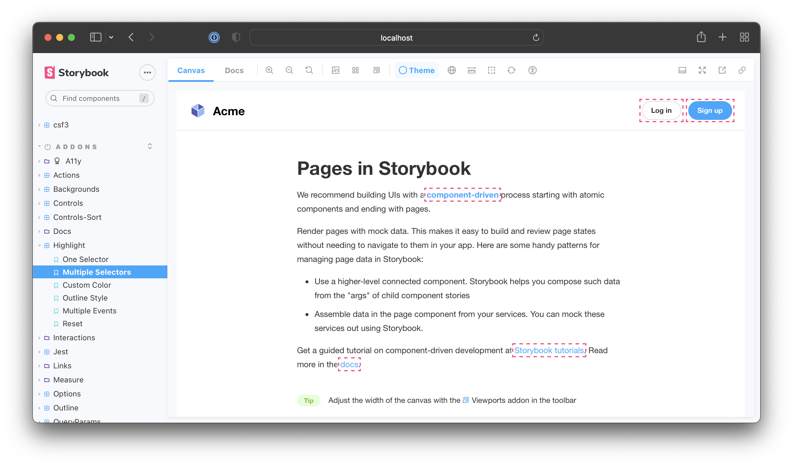

Storybook's [Highlight](https://storybook.js.org/addons/@storybook/addon-highlight/) addon allows you to highlight specific DOM nodes within your story. You can use it to call attention to particular parts of the story.



This addon can be used to enhance other addons. For example, [Accessibility](https://storybook.js.org/addons/@storybook/addon-a11y/) addon uses it to highlight DOM nodes that are failing accessibility checks.

## Apply or clear highlights

Highlight DOM nodes by emitting the `HIGHLIGHT` event from within a story or an addon. The event payload must contain a list of selectors you want to highlight.

```js
import React, { useEffect } from 'react';
import { useChannel } from '@storybook/addons';
import { HIGHLIGHT, RESET_HIGHLIGHT } from '@storybook/addon-highlight';
import { MyComponent } form './MyComponent';

export default { component: MyComponent };

export const MyStory = () => {
  const emit = useChannel({});

  useEffect(() => {
    emit(HIGHLIGHT, {
      elements: ['.title', '.subtitle'],
    });
  }, []);

  return <MyComponent />;
};
```

Highlights are automatically cleared when the story changes. You can also manually clear them by emitting the `RESET_HIGHLIGHT` event.

```js
emit(RESET_HIGHLIGHT);
```

## Customize style

```js
emit(HIGHLIGHT, {
  elements: ['.title', '.subtitle'],
  color: 'red',
  style: 'solid', // 'dotted' | 'dashed' | 'solid' | 'double'
});
```
