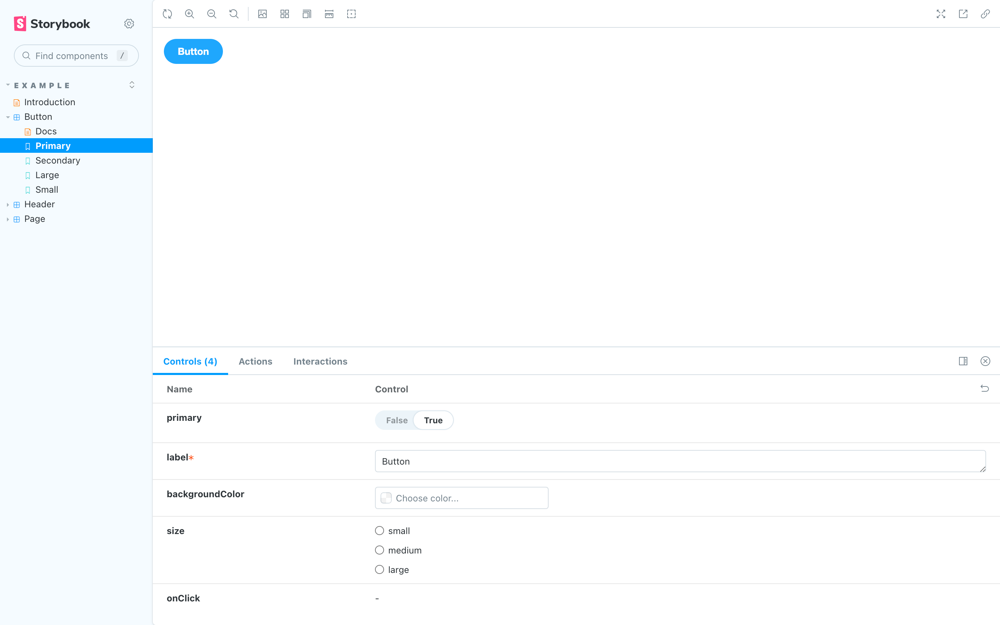

A story captures the rendered state of a UI component. Developers write multiple stories per component that describe all the “interesting” states a component can support.

When you installed Storybook, the CLI created example components that demonstrate the types of components you can build with Storybook: Button, Header, and Page.

Each example component has a set of stories that show the states it supports. You can browse the stories in the UI and see the code behind them in files that end with `.stories.js|ts`. The stories are written in [Component Story Format](../api/csf.md) (CSF), an ES6 modules-based standard for writing component examples.

Let’s start with the `Button` component. A story is an object that describes how to render the component in question. Here’s how to render `Button` in the “primary” state and export a story called `Primary`.

<!-- prettier-ignore-start -->

<CodeSnippets
  paths={[
    'react/button-story-with-args.js.mdx',
    'react/button-story-with-args.ts.mdx',
    'vue/button-story-with-args.3.js.mdx',
    'vue/button-story-with-args.3.ts.mdx',
    'angular/button-story-with-args.ts.mdx',
    'web-components/button-story-with-args.js.mdx',
    'web-components/button-story-with-args.ts.mdx',
    'svelte/button-story-with-args.js.mdx',
    'svelte/button-story-with-args.ts.mdx',
    'html/button-story-with-args.js.mdx',
    'html/button-story-with-args.ts.mdx',
    'preact/button-story-with-args.js.mdx',
    'solid/button-story-with-args.js.mdx',
    'solid/button-story-with-args.ts.mdx',
  ]}
  usesCsf3
  csf2Path="get-started/whats-a-story#snippet-button-story-with-args"
/>

<!-- prettier-ignore-end -->

View the rendered `Button` by clicking on it in the Storybook sidebar. Note how the values specified in [`args`](../writing-stories/args.md) are used to render the component and match those represented in the [Controls](../essentials/controls.md) tab. Using `args` in your stories has additional benefits:

- `Button`'s callbacks are logged into the [Actions](../essentials/actions.md) tab. Click to try it.
- `Button`'s arguments are dynamically editable in the Controls tab. Adjust the controls.

## Working with stories

Storybook makes it easy to work on one component in one state (aka a story) at a time. When you edit a component's code or its stories, Storybook will instantly re-render in the browser. No need to refresh manually.

### Create a new story

<If renderer="react">

If you're working on a component that does not yet have any stories, you can click the ➕ button in the sidebar to search for your component and have a basic story created for you.

<video autoPlay muted playsInline loop>
  <source
    src="new-component-story-from-plus-button-optimized.mp4"
    type="video/mp4"
  />
</video>

You can also create a story file for your new story. We recommend copy/pasting an existing story file next to the component source file, then adjusting it for your component.

</If>

<If notRenderer="react">

If you're working on a component that does not yet have any stories, you can create a story file for your component with a new story. We recommend copy/pasting an existing story file next to the component source file, then adjusting it for your component.

</If>

<video autoPlay muted playsInline loop>
  <source
    src="new-component-story-in-code-optimized.mp4"
    type="video/mp4"
  />
</video>

If you're working on a component that already has other stories, you can use the [Controls addon](../essentials/controls.md) to adjust the value of a control and then save those changes as a new story.

<video autoPlay muted playsInline loop>
  <source
    src="new-story-from-controls-optimized.mp4"
    type="video/mp4"
  />
</video>

Or, if you prefer, edit the story file's code to add a new named export for your story:

<video autoPlay muted playsInline loop>
  <source
    src="new-story-in-code-optimized.mp4"
    type="video/mp4"
  />
</video>

### Edit a story

Using the [Controls addon](../essentials/controls.md), update a control's value for a story. You can then save the changes to the story and the story file's code will be updated for you.

<video autoPlay muted playsInline loop>
  <source
    src="edit-story-from-controls-optimized.mp4"
    type="video/mp4"
  />
</video>

Of course, you can always update the story's code directly too:

<video autoPlay muted playsInline loop>
  <source
    src="edit-story-in-code-optimized.mp4"
    type="video/mp4"
  />
</video>

Stories are also helpful for checking that UI continues to look correct as you make changes. The `Button` component has four stories that show it in different use cases. View those stories now to confirm that your change to `Primary` didn’t introduce unintentional bugs in the other stories.

<video autoPlay muted playsInline loop>
  <source
    src="example-button-browse-stories-optimized.mp4"
    type="video/mp4"
  />
</video>

Checking component’s stories as you develop helps prevent accidental regressions. [Tools that integrate with Storybook can automate this](../writing-tests/index.md) for you.

Now that we’ve seen the basic anatomy of a story let’s see how we use Storybook’s UI to develop stories.
