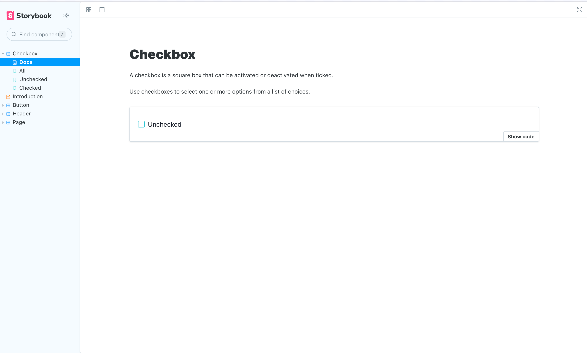
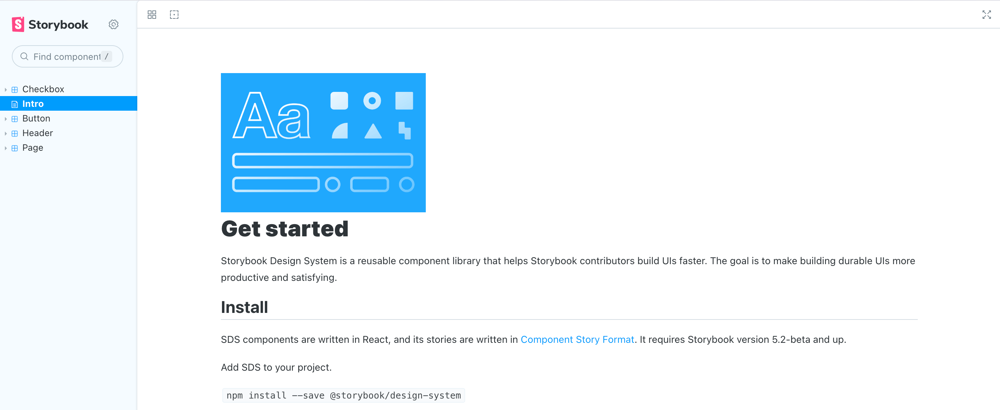

[MDX](https://mdxjs.com/) files mix Markdown and Javascript/JSX to create rich interactive documentation. You can use Markdown’s readable syntax (such as `# heading`) for your documentation, include stories defined in [Component Story Format (CSF)](../api/csf.md), and freely embed JSX component blocks at any point in the file. All at once.

In addition, you can write pure documentation pages in MDX and add them to Storybook alongside your stories.


<div class="aside">

Writing stories directly in MDX was deprecated in Storybook 7. Please reference the <LinkWithVersion version="6.5" href="./mdx.md">previous documentation</LinkWithVersion> for guidance on that feature.

</div>

## Basic example

Let's get started with an example, `Checkbox.mdx`, that combines Markdown with a single story.

<!-- prettier-ignore-start -->

<CodeSnippets
  paths={[
    'common/checkbox-story.mdx.mdx',
  ]}
/>

<!-- prettier-ignore-end -->

This MDX file references a story file, `Checkbox.stories.js`, that is written in [Component Story Format (CSF)](../api/csf.md):

<!-- prettier-ignore-start -->

<CodeSnippets
  paths={[
    'common/checkbox-story-csf.js.mdx',
  ]}
  usesCsf3
  csf2Path="writing-docs/mdx#snippet-checkbox-story-csf"
/>

<!-- prettier-ignore-end -->

And here's how that's rendered in Storybook:



There’s a lot going on here. We're writing Markdown, we're writing JSX, and we're also defining and referencing Storybook stories that are drop-in compatible with the entire Storybook ecosystem.

Let’s break it down.

### MDX and CSF

The first thing you'll notice is that the component documentation is divided into distinct formats: one for writing component stories describing each possible component state and the second one for documenting how to use them. This split leverages the best qualities of each format:

- **CSF** is great for succinctly defining stories (component examples). If you use TypeScript, it also provides type safety and auto-completion.
- **MDX** is great for writing structured documentation and composing it with interactive JSX elements.

<div class="aside">

💡 If you’re coming from a previous version of Storybook, you might be accustomed to using MDX both for **documentation** and for defining **stories** in the same `.stories.mdx` file. We’ve deprecated this functionality and plan to remove it in a future version of Storybook. We provide [migration](#automigration) scripts to help you onto the new format.

</div>

### Anatomy of MDX

Assuming you’re already familiar with writing stories with [CSF](../writing-stories/introduction.md), we can dissect the MDX side of things in greater detail.

The document consists of a number of blocks separated by blank lines. Since MDX mixes a few different languages together, it uses those blank lines to help distinguish where one starts, and the next begins. Failing to separate blocks by whitespace can cause (sometimes cryptic) parse errors.

Going through the code blocks in sequence:

<!-- prettier-ignore-start -->

```mdx
{ /* Checkbox.mdx */ }
```

<!-- prettier-ignore-end -->

Comments in MDX are JSX blocks that contain JS comments.

<!-- prettier-ignore-start -->

<CodeSnippets
  paths={[
    'common/storybook-auto-docs-mdx-docs-imports.mdx.mdx',
  ]}
/>

<!-- prettier-ignore-end -->

Imports the components and stories that will be used in the JSX throughout the rest of the file.

<!-- prettier-ignore-start -->

<CodeSnippets
  paths={[
    'common/storybook-auto-docs-mdx-docs-meta-block.mdx.mdx',
  ]}
/>

<!-- prettier-ignore-end -->

The `Meta` block defines where the document will be placed in the sidebar. In this case, it is adjacent to the Checkbox’s stories. By default, the docs sidebar node is titled `"Docs"`, but this can be customized by passing a `name` prop (e.g., `<Meta of={CheckboxStories} name="Info" />`). If you want to place a docs node at an arbitrary point in the navigation hierarchy, you can use the `title` prop (e.g., `<Meta title="path/to/node" />`).

<!-- prettier-ignore-start -->

<CodeSnippets
  paths={[
    'common/storybook-auto-docs-mdx-docs-definition.mdx.mdx',
  ]}
/>

<!-- prettier-ignore-end -->

MDX2 supports standard markdown ([”commonmark”](https://commonmark.org/)) by default and can be extended to support [GitHub-flavored markdown (GFM)](https://github.github.com/gfm) and other extensions (see [Breaking changes](#breaking-changes), below).

<!-- prettier-ignore-start -->

<CodeSnippets
  paths={[
    'common/storybook-auto-docs-mdx-docs-story.mdx.mdx',
  ]}
/>

<!-- prettier-ignore-end -->

Finally, MDX supports blocks of arbitrary JSX.

In this case, we are leveraging “Doc Blocks”, a library of documentation components designed to work with Storybook stories to show your stories, your component APIs & controls for interacting with your components inside your documentation, among other utilities.

In addition to Doc Blocks, MDX can incorporate arbitrary React components, making it a very flexible documentation system. Suppose you want a stylized list of “dos and don’ts” for your component; you can use off-the-shelf components or write your own.

<!-- prettier-ignore-start -->

<CodeSnippets
  paths={[
    'common/storybook-auto-docs-mdx-docs-dos-donts.mdx.mdx',
  ]}
/>

<!-- prettier-ignore-end -->

### Known limitations

While MDX2 supports a variety of runtimes ([React](https://mdxjs.com/packages/react/), [Preact](https://mdxjs.com/packages/preact/), [Vue](https://mdxjs.com/packages/vue/)), Storybook’s implementation is React-only. That means your documentation is rendered in React, while your stories render in the runtime of your choice (React, Vue, Angular, Web Components, Svelte, etc.).

## Breaking changes

There are a lot of breaking changes if you’re moving from MDX1 to MDX2. As far as we know, all of these are due to changes in the MDX library itself rather than changes to Storybook’s usage. Nevertheless, as an MDX user, you will probably need to update your MDX files as part of the upgrade. MDX has published their own [Migration guide](https://mdxjs.com/migrating/v2/#update-mdx-files). Here we try to summarize some of the key changes for Storybook users.

### Custom components apply differently

From the MDX migration guide:

> We now “sandbox” components, for lack of a better name. It means that when you pass a component for `h1`, it does get used for `# hi` but not for `<h1>hi</h1>`

This means that the first heading in the following example gets replaced, whereas the second does not. It may not sound like a significant change, but in practice, it is highly disruptive and manifests itself in various ways. Unfortunately, this cannot be automatically converted in a safe way.

<!-- prettier-ignore-start -->

```md
# Some heading

<h1>another heading</h1>
```

<!-- prettier-ignore-end -->

### Lack of GitHub Flavored Markdown (GFM)

Also, from the MDX migration guide:

> We turned off GFM features in MDX by default. GFM extends CommonMark to add autolink literals, footnotes, strikethrough, tables, and task lists. If you do want these features, you can use a plugin. How to do so is described in [our guide on GFM](https://mdxjs.com/guides/gfm/).

In Storybook, you can apply MDX options, including plugins, in the main configuration file:

<!-- prettier-ignore-start -->

<CodeSnippets
paths={[
  'common/storybook-main-config-remark-options.js.mdx',
  'common/storybook-main-config-remark-options.ts.mdx',
]}
/>

<!-- prettier-ignore-end -->

<div class="aside">

💡 The [`remark-gfm`](https://github.com/remarkjs/remark-gfm) package isn't provided by default during migration. We recommend installing it as a development dependency if you use its features.

</div>

### Automigration

To help you transition to the new version, we've created a migration helper in our CLI. We recommend using it and reaching out to the maintainers using the default communication channels (e.g., [Discord server](https://discord.com/channels/486522875931656193/570426522528382976), [GitHub issues](https://github.com/storybookjs/storybook/issues)) for problems you encounter.

```shell
npx storybook@next automigrate --fixId mdx1to2
```

## Documentation-only MDX

MDX documents can also be used to create documentation-only pages. Suppose you're documenting an existing component and only provide a `<Meta>` Doc Block without additional props or `Story` blocks. In that case, Storybook will consider it as "documentation-only" and appear differently in the sidebar navigation menu:

<!-- prettier-ignore-start -->

<CodeSnippets
paths={[
  'common/storybook-auto-docs-mdx-docs-docs-only-page.mdx.mdx',
]}
/>

<!-- prettier-ignore-end -->



<!--
TODO: Uncomment once support for `transcludeMarkdown` is confirmed

### Creating a Changelog story

One common use case for documentation-only MDX is importing a project's `CHANGELOG.md`, so that users can easily refer to the CHANGELOG via a documentation node in Storybook.

First, ensure that `transcludeMarkdown` is set to `true` in `main.js`:

<!-- prettier-ignore-start - ->

<CodeSnippets
  paths={[
    'common/storybook-main-enable-transcludemarkdown.js.mdx',
  ]}
/>

<!-- prettier-ignore-end - ->

Then, import the markdown and treat the imported file as a component in the MDX file:

```mdx
import { Meta } from '@storybook/blocks';

import Changelog from '../CHANGELOG.md';

<Meta title="Changelog" />

<Changelog />
```


-->

## Linking to other stories and pages

When writing MDX, you may want to provide links to other stories or documentation pages and sections. You can use the `path` query string.

Considering a story with ID `some--id`, this redirects to the **Docs** tab of the story:

```md
[Go to specific documentation page](?path=/docs/some--id)
```

This redirects to the **Canvas** tab of the story:

```md
[Go to specific story canvas](?path=/story/some--id)
```

You can also use anchors to target a specific section of a page:

```md
[Go to the conclusion of the documentation page](?path=/docs/some--id#conclusion)
```

<div class="aside">
💡 By applying this pattern with the Controls addon, all anchors will be ignored in Canvas based on how Storybook handles URLs to track the args values.
</div>


#### Learn more about Storybook documentation

- [Docs](./docs-page.md) for creating documentation for your stories
- MDX for customizing your documentation
- [Publishing docs](./build-documentation.md) to automate the process of publishing your documentation
