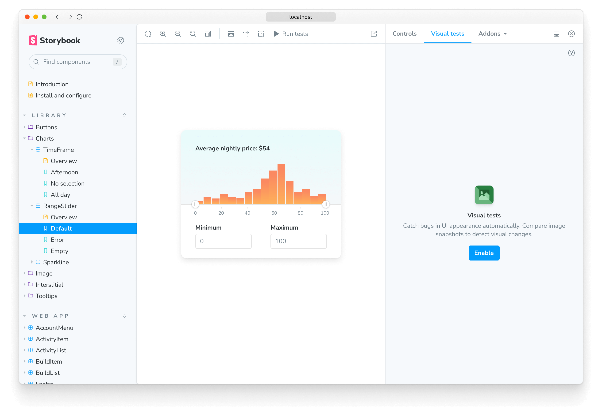
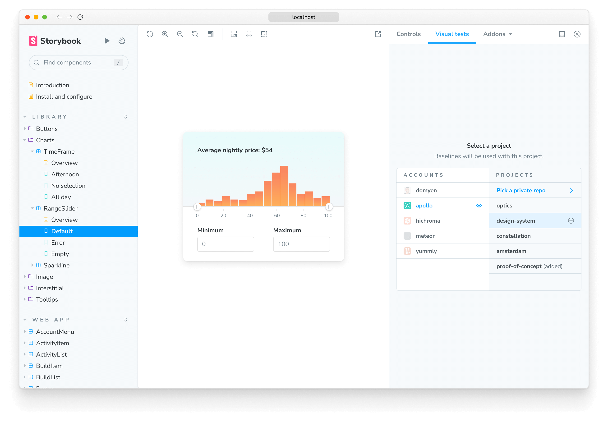
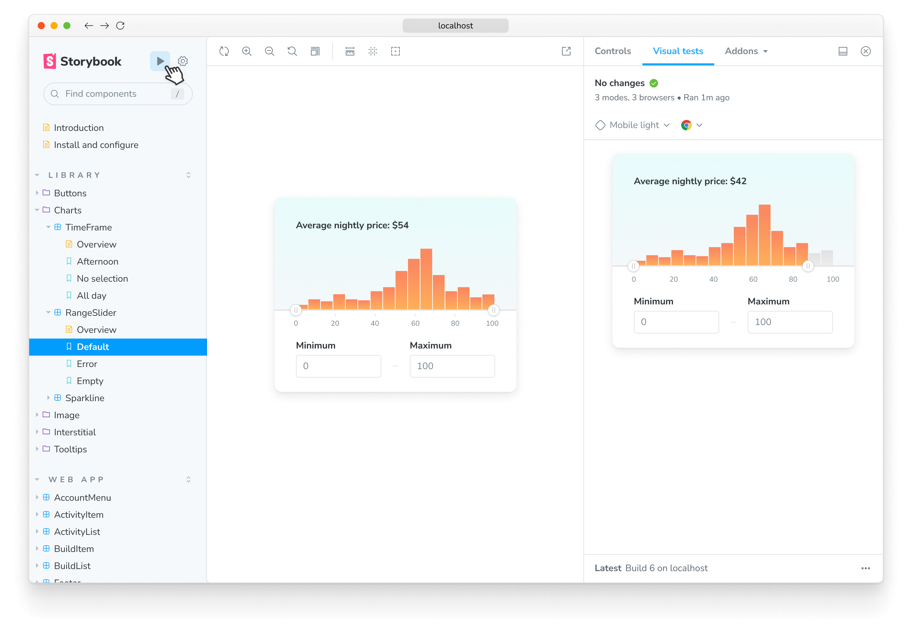
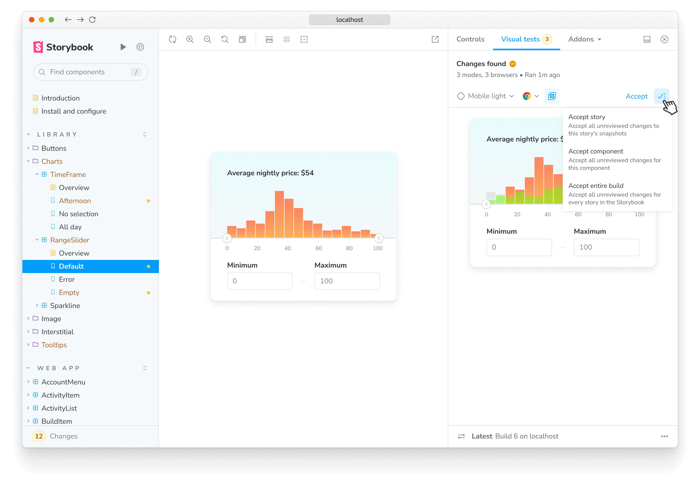

Visual tests, also called visual regression tests, catch bugs in UI appearance. They work by taking screenshots of every story and comparing them commit-to-commit to identify changes.

Ideal for verifying what the user sees: layout, color, size, and contrast. Storybook is a fantastic tool for visual testing because every story is essentially a test specification. Any time you write or update a story, you get a spec for free.

<!--
  TODO: Update hero video with a new one that shows the visual testing flywheel for the addon and CI
 -->
<video autoPlay muted playsInline loop>
  <source
    src="component-visual-testing-optimized.mp4"
    type="video/mp4"
  />
</video>

<!--

TODO: Reframe or remove this section to focus on the addon
 -->

There are [many tools](https://github.com/mojoaxel/awesome-regression-testing) for visual testing. We recommend [Chromatic](https://www.chromatic.com?utm_source=storybook_website&utm_medium=link&utm_campaign=storybook) by Storybook maintainers to run visual tests in a lightning-fast cloud browser environment.

For a self-managed alternative to Chromatic, we offer [test runner](./test-runner.md). It allows you to run visual tests on stories by integrating with [Jest](https://jestjs.io/) and [Playwright](https://playwright.dev/). Here's an example [recipe for visual testing stories](https://github.com/storybookjs/test-runner#image-snapshot-recipe).

## Visual Tests addon for Storybook

<Callout variant="info" style={{ marginBottom: "2rem" }}>

🧪 Currently in beta: [Sign up for early access](https://forms.gle/NCDV1BMGuNfjWrPm9)

</Callout>

The Visual Tests addon turns your stories into visual tests. Powered by Chromatic, which allows you to pinpoint UI bugs and get instant feedback without leaving Storybook.

### Setup

If you want to check visual changes locally in your development environment using the addon, you'll need to install it and add it to your Storybook. Run the following command to automate the setup process:

<!-- prettier-ignore-start -->

<CodeSnippets
  paths={[
    'common/visual-test-addon-install.npx.js.mdx',
    'common/visual-test-addon-install.yarn.js.mdx',
    'common/visual-test-addon-install.pnpm.js.mdx',
  ]}
/>

<!-- prettier-ignore-end -->

<Callout variant="info">

The addon requires Storybook 7.4 or higher. Read the [migration guide](../migration-guide.md) to help you upgrade your project.

</Callout>

When you start Storybook, you'll see a new addon panel for "Visual Tests" where you can run tests and view the results.



### Authentication

To enable visual testing with the addon, you must authenticate yourself with [Chromatic](https://www.chromatic.com?utm_source=storybook_website&utm_medium=link&utm_campaign=storybook). Sign in to create a new project or link an existing project.

You'll see list of available projects that you have access to. Select a project to finish setup. The addon will automatically adjust the configuration file, add the necessary project identifiers, and retrieve any existing baselines if available.



### Configure

Out of the box, the Visual Tests addon includes configuration options covering most use cases. You can also fine-tune the addon configuration to match your project's requirements via the [`.storybook/chromatic.config.json`](https://www.chromatic.com/docs/cli#configuration) file. Listed below are the available options and examples of how to use them.

| Option            | Description                                                                                                                              |
| ----------------- | ---------------------------------------------------------------------------------------------------------------------------------------- |
| `buildScriptName` | Optional. Defines the custom Storybook build script <br/> `options: { buildScriptName: 'deploy-storybook' }`                             |
| `debug`           | Optional. Output verbose debugging information to the console. <br/> `options: { debug: true }`                                          |
| `projectId`       | Automatically configured. Sets the value for the project identifier <br/> `options: { projectId: Project:64cbcde96f99841e8b007d75 }`     |
| `zip`             | Recommended for large projects. Configures the addon to deploy your Storybook to Chromatic as a zip file. <br/> `options: { zip: true }` |

```jsonc
// .storybook/chromatic.config.json
{
  "buildScriptName": "deploy-storybook",
  "debug": true,
  "projectId": "Project:64cbcde96f99841e8b007d75",
  "zip": true
}
```

<!--

TODO: Adjust this section to align with Storybook's voice and tone
 -->

### How to run visual tests

Click the ▶️ Play button in the Storybook sidebar to start visual testing. Behind the scenes, this sends your stories to the cloud to snapshot and find visual changes.



<!--

TODO: Adjust this section to align with Storybook's voice and tone
 -->

### Review changes

The addon highlights which stories require your attention 🟡 in the Storybook sidebar. Results will stream in while the test runs.

Use the "Visual Tests" addon tab to see which pixels changed. If the changes are intentional, accept them as baselines. If they're not intentional, fix the story and run the tests again with the ▶️ Play button.



When you finish accepting changes as baselines in the addon, you're ready to push the code to your remote repository. If you have Chromatic running in CI (recommended), your updated baselines will be reconciled automatically without you having to re-accept changes.

## Automate visual tests in CI

Visual testing with Storybook and the addon is a powerful combination to help catch UI changes early and prevent regressions during development. We recommend automating visual tests with CI and Chromatic to ensure your UI remains consistent across various environments. This provides a comprehensive solution for maintaining UI quality throughout your project's lifecycle. To learn more, read Chromatic's [documentation](https://www.chromatic.com/docs/ci?utm_source=storybook_website&utm_medium=link&utm_campaign=storybook).

---

#### What’s the difference between visual tests and snapshot tests?

Snapshot tests compare the rendered markup of every story against known baselines. This means the test compares blobs of HTML and not what the user actually sees. Which in turn, can lead to an increase in false positives as code changes don’t always yield visual changes in the component.

**Learn about other UI tests**

- [Test runner](./test-runner.md) to automate test execution
- Visual tests for appearance
- [Accessibility tests](./accessibility-testing.md) for accessibility
- [Interaction tests](./interaction-testing.md) for user behavior simulation
- [Coverage tests](./test-coverage.md) for measuring code coverage
- [Snapshot tests](./snapshot-testing.md) for rendering errors and warnings
- [End-to-end tests](./stories-in-end-to-end-tests.md) for simulating real user scenarios
- [Unit tests](./stories-in-unit-tests.md) for functionality
